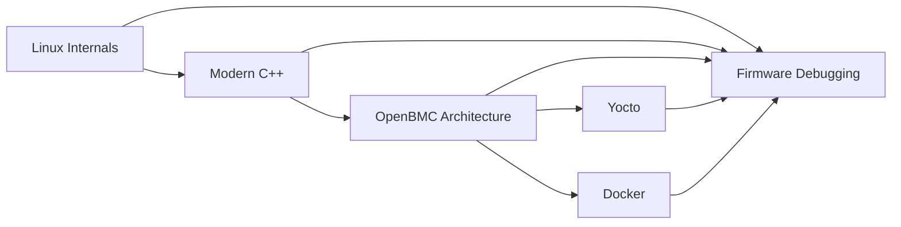

# Learning Roadmap

這份 Roadmap 不是要把所有主題照教科書排序，而是以 Firmware Engineer 的學習曲線來安排。

## 建議學習順序

## Phase 規劃

### Phase 1: Linux Fundamentals

- 先建立 user space / kernel space、system call、process、thread、memory 的底層概念
- 這一層會直接影響後面看 OpenBMC service 與 debug 的速度

### Phase 2: Modern C++ for Firmware

- 把語法記憶轉成 ownership、lifetime、abstraction 與可維護性的理解
- 這層會影響你之後寫 service、library 與 debug 複雜問題的品質

### Phase 3: OpenBMC Architecture

- 建立 OpenBMC 的系統觀，而不是只記得零散元件名稱
- 這一層把 Linux 與實際 BMC 平台連起來

### Phase 4: Build and Delivery

- 用 Yocto 理解 build system
- 用 Docker 固定開發環境與 CI 行為

### Phase 5: Debugging as a Core Skill

- 把 Linux、C++、OpenBMC、build system 的知識，最後都收斂到真實除錯能力

:::note 為什麼不是先學 OpenBMC

如果太早直接跳進 OpenBMC，很容易把 service、D-Bus、sensor、Redfish 當成名詞背誦。

先有 Linux Internals 與 Modern C++ 的底，再回來看 OpenBMC，理解會更穩。
:::

## 長期維護策略

- 每個主題先有 category landing page
- 每個 category 底下再拆子目錄
- 一個主題只要開始累積，就維持固定命名與固定章節習慣
- 每篇文件都盡量保留 debug perspective 與 interview takeaway
