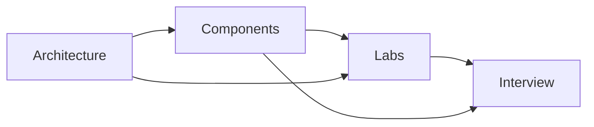

# Learning Roadmap

這份 roadmap 不是把主題照教科書排列，而是依照 firmware engineer 真正會遇到的工作路徑來安排。

## 學習順序

```mermaid
flowchart LR
    A[Architecture] --> B[Components]
    B --> C[Labs]
    C --> D[Interview]
    A --> C
    B --> D
```

## 四個階段

### Stage 1: Architecture

- 先建立 OpenBMC、Linux、driver、bus、protocol 的整體地圖
- 先回答「資料從哪裡來、狀態在哪裡、哪一層負責什麼」
- 現階段既有 Linux Internals 文章會是這一區最早的內容資產

### Stage 2: Components

- 把每個 daemon、library、service 放回系統上下文
- 不是只記元件名稱，而是理解：
  - 它是什麼
  - 誰呼叫它
  - 它呼叫誰
  - 用什麼 IPC
  - 程式入口在哪裡

### Stage 3: Labs

- 把 build、trace、debug 變成可以自己執行與驗證的實作
- 第一版先建立 Build、Trace、Debug、Mini Project 四條練習路徑
- `Yocto`、`Docker`、`Firmware Debugging` 會先作為這一區的既有內容入口

### Stage 4: Interview

- 最後確認自己是否真的能說清楚、畫出來、讀得動 code、答得出 debug 題
- 如果這一階段講不清楚，前面的理解通常還不夠穩

## 單頁閱讀順序

每一個主題頁面都盡量依照同一個順序設計：

1. Architecture
2. Components
3. Terminology
4. Data Flow
5. IPC
6. Code Mapping
7. Debug
8. Checkpoint

這個順序的目的，是避免一開始就被規格或名詞淹沒。

## 第一版優先範圍

- 新首頁
- 新 sidebar
- Architecture / Components / Labs / Interview 目錄骨架
- 各分類 intro 頁
- 元件統一模板
- `phosphor-mctp` 示範骨架
- 既有內容重新分類但不刪除

## 保留原有筆記的方式

- 不直接丟掉原本的 landing page 與外部 repo
- 先把可沿用內容接到新的資訊架構
- 未納入第一版主線的內容，先放在 `Knowledge Base`
