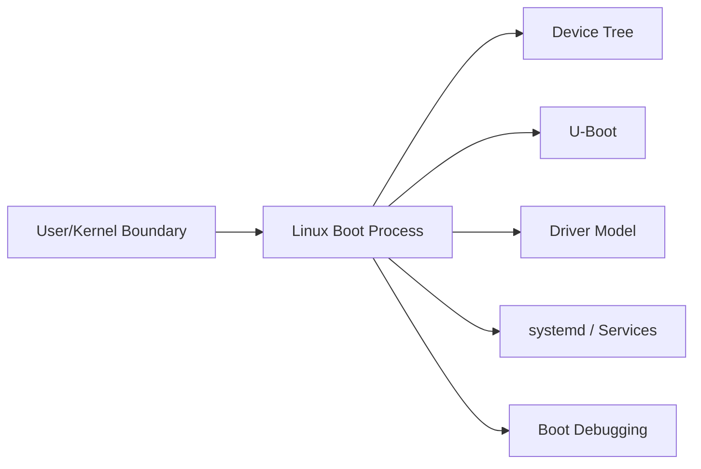
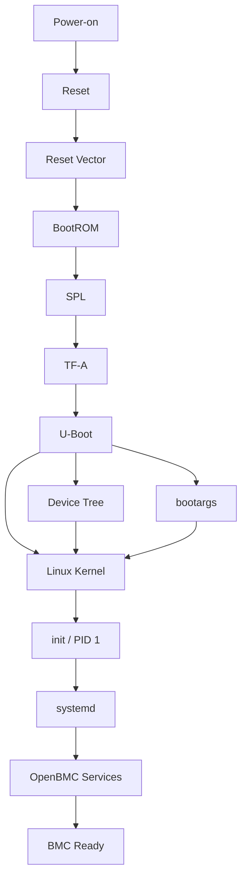
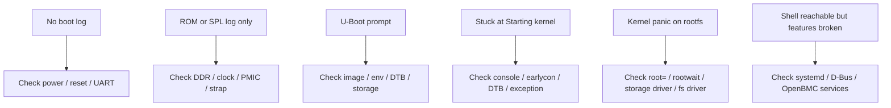

## Metadata

| Item | Value |
| --- | --- |
| Category | Linux Internals / BSP |
| Difficulty | Intermediate |
| Importance | High |
| Interview Frequency | High |
| Related Topics | U-Boot, Device Tree, Linux Driver Model, Memory Initialization, systemd, OpenBMC Architecture |

## 一句話總結

Linux boot process 本質上是一條分階段 bring-up 與 handoff 的鏈，從 power-on 開始，先讓 CPU 有地方取第一條指令，再逐步把 DRAM、bootloader、kernel、rootfs 與 user space service 帶起來，最後才變成一個真正可用的系統。

## 關鍵名詞速查

| Term | One-line Explanation |
| --- | --- |
| Power-on Reset | 上電後把 SoC 拉回可預期初始狀態的起點。 |
| Reset Vector | CPU reset 後第一條指令要去取的位置。 |
| BootROM | SoC 內建、通常不可修改的第一階段啟動程式。 |
| SPL | `Secondary Program Loader`，先做最小硬體初始化，特別是 DRAM。 |
| TF-A | `Trusted Firmware-A`，常見於 ARMv8 平台，負責 secure monitor / EL3 相關初始化與 handoff。 |
| U-Boot | 常見 bootloader，負責載入 kernel、DTB、bootargs，並決定 boot policy。 |
| Device Tree | 描述 board 硬體拓撲與資源配置的資料。 |
| bootargs | bootloader 傳給 kernel 的 command line 參數。 |
| earlycon | 讓 kernel 在很早期就能吐 console log 的機制。 |
| initramfs | kernel 早期可用的暫時 root filesystem。 |
| rootfs | Linux kernel 進入 user space 前最終要掛載的根檔案系統。 |
| init | kernel 啟動的第一個 user space process，PID 1。 |
| systemd | 常見的 init system，負責啟動與管理服務。 |
| OpenBMC Services | 例如 `phosphor-*`、`bmcweb`、sensor service 等產品功能服務。 |

## Knowledge Map

### 1. Prerequisite knowledge

先有這些底會更容易理解這篇：

- User Space vs Kernel Space
- 基本 memory map 概念
- UART / serial console 基本使用
- Device Tree 基本概念
- Bootloader 與 kernel 的角色差異

### 2. Related topics

這篇會直接連到：

- `04-device-tree.md`
- `05-linux-driver-model.md`
- `06-u-boot.md`
- `12-memory-management.md`
- `15-linux-debugging.md`

### 3. What should be learned next

看完 boot process 後，最適合接著學的是：

1. Device Tree
2. U-Boot
3. Linux Driver Model
4. systemd / service dependency

因為實際 boot failure 很少只停在單一主題，通常都會跨這幾層。

### 4. How this topic is used in OpenBMC

在 OpenBMC 裡，這個主題直接影響：

- BMC image 是否能正常開機
- sensor / inventory 相關 service 是否能被正確帶起來
- `bmcweb` / Redfish / network 何時真的 ready
- 韌體更新後的 boot regression 分析

### 5. How this topic is used in BSP development

在 BSP bring-up 裡，這個主題幾乎每天都會碰到：

- 新板子上電沒 log
- DDR training fail
- 換 flash / eMMC layout 後 boot 失敗
- 換 kernel / DTB 後卡在 `Starting kernel...`
- rootfs mount fail

### 6. How this topic appears in firmware interviews

面試官常不是只問「流程是什麼」，而是想看你能不能回答：

- 為什麼需要 `SPL`
- `TF-A` 在 ARMv8 平台在做什麼
- `Device Tree` 在 boot 中怎麼交接
- `Starting kernel...` 該怎麼 debug
- kernel 起來跟 BMC ready 差在哪



## 為什麼重要

Linux 需要 boot process，因為 SoC 在 power-on 當下其實沒有「直接跑 Linux」的條件。

一開始缺的東西很多：

- CPU 只知道 reset vector，不知道整套系統怎麼起來
- DRAM 可能還沒初始化
- storage controller 可能還不能讀
- kernel image 還沒進 memory
- kernel 也不知道這塊 board 上有哪些 device
- user space 更不可能直接開始跑 service

所以 boot process 解決的是一連串前置問題：

1. CPU 第一條指令從哪裡來
2. 如何把更大的 bootloader 載起來
3. 如何把 DRAM 變成可用
4. 如何把 kernel 與 DTB 載入
5. kernel 怎麼知道 rootfs 在哪裡
6. user space service 要由誰管理

如果沒有這套 staged design，後果會很直接：

- CPU 上電後根本不知道先執行什麼
- 沒有小型前導 loader，就無法在 DRAM 未 ready 時載入完整 bootloader
- 沒有 DTB，kernel 幾乎不知道 board-specific 硬體配置
- 沒有 bootargs，kernel 不知道 console / rootfs / init 該怎麼處理
- 沒有 `init` / `systemd`，kernel 起來也無法變成產品可用系統

從 firmware 工程角度看，boot process 最大的價值不是「流程圖好看」，而是讓問題能分層 debug。  
你可以明確問：

- 最後一個成功的 stage 是誰？
- 它交出了什麼？
- 下一個 stage 為什麼沒接起來？

## 核心觀念

### 1. Boot 是 staged bring-up，不是一次到位

Linux boot 不是「跳進 kernel 就結束」，而是一條逐步建立執行環境的鏈。前一段只負責做下一段所需的最小準備。

### 2. Reset Vector 存在是因為 CPU 上電時必須有固定入口

從第一原理看，CPU reset 後如果沒有固定取指位置，它就不可能開始執行任何東西。  
這也是為什麼 Reset Vector 通常由 SoC 架構定義，而不是 Linux 定義。

如果這個機制不存在：

- CPU 上電後沒有第一條指令來源
- 整個 boot chain 根本無法開始

### 3. BootROM 存在是因為系統需要一段「最早、最可信、最小」的啟動邏輯

BootROM 的存在是為了解決：

- 決定 boot source
- 讀取第一段 image
- 在外部 memory / driver 還沒完整可用前，先建立第一個 handoff

如果沒有 BootROM：

- SoC 無法統一定義最早期的 boot 行為
- 每塊板子都要自己想辦法讓 CPU 知道從哪裡讀第一段 code

### 4. SPL 存在是因為完整 bootloader 常常太大，且依賴 DRAM

這是 BSP 面試很常問的點。

`U-Boot proper` 通常不適合直接在最早期執行，因為：

- image 太大
- 很多功能依賴 DRAM
- 早期可用的通常只有 SRAM / on-chip memory

所以需要 `SPL`：

- 先做 clock / pinmux / PMIC / DDR 初始化
- 再把完整 bootloader 載進 DRAM

如果沒有 SPL：

- 你得把完整 bootloader 硬塞進極小 early memory
- 或者根本無法在 DRAM 未 ready 時把後續 image 帶起來

### 5. TF-A 存在是因為 ARMv8 平台需要處理 secure world / EL3 handoff

不是所有平台都會明顯看到 `TF-A`，但在很多 ARMv8 / BMC 平台上，它很常存在。

它主要解決：

- EL3 / secure monitor 初始化
- PSCI 等 power management / CPU bring-up 介面
- secure world 與 non-secure world handoff

如果這層出問題：

- 可能不是連 U-Boot 都進不去，而是更微妙的 handoff fail
- 多核 bring-up、PSCI、exception level 切換可能異常

工程上要抓的重點不是背 BL1/BL2/BL31 編號，而是知道：

- 這層不是 Linux kernel
- 這層也不只是一般 bootloader
- 它常常是 secure / privilege handoff 的關鍵

### 6. Device Tree 存在是為了把 board-specific 知識從 kernel code 抽開

同一份 kernel image 不應該硬編碼每塊板子的硬體細節。

所以 DTB 解決的是：

- board 上有哪些 device
- 它們掛在哪條 bus
- 用哪個 IRQ / clock / regulator / reset
- console 路徑是什麼

如果沒有 Device Tree：

- board variant 幾乎都要改 kernel code
- driver 與 board description 會緊耦合
- BSP 維護成本會很高

### 7. bootargs 是 bootloader 傳給 kernel 的最重要文字 handoff 之一

常見內容像：

- `console=`
- `earlycon`
- `root=`
- `rootwait`
- `init=`
- `loglevel=8`
- `initcall_debug`

如果沒有 bootargs：

- kernel 不知道 log 該吐到哪個 console
- rootfs 不知道從哪裡掛
- debug 時看不到關鍵早期資訊

### 8. `kernel boot success` 不等於 `BMC ready`

這是 OpenBMC 非常重要的觀念。

可能發生：

- kernel 已經起來
- rootfs 已掛載
- `systemd` 也進來了

但：

- D-Bus 還沒 ready
- sensor service 沒起
- `bmcweb` 掛掉
- inventory 不完整

所以從產品角度看，真正的「boot ready」通常要看：

- kernel ready
- user space ready
- service graph ready
- product function ready

## 比較表

| Stage | 主要責任 | 典型 Input | 典型 Output | 下一個 Handoff | 常見失敗症狀 |
| --- | --- | --- | --- | --- | --- |
| Power-on / Reset | 讓 SoC 回到初始狀態 | 電源、reset、strap | CPU 開始從 reset vector 取指 | BootROM | 完全沒 log、reset loop |
| Reset Vector | 提供第一條指令入口 | CPU reset 狀態 | 開始執行 ROM code | BootROM | 無法開始 boot |
| BootROM | 載入第一段外部程式 | boot source、image header | SPL / first-stage loader | SPL / TF-A / U-Boot | silent、recovery mode |
| SPL | 最小硬體 bring-up、DDR init | ROM 載入的 early image | DRAM ready、U-Boot loaded | TF-A / U-Boot | 卡在早期 log、DDR fail |
| TF-A | secure handoff / EL3 setup | SPL 或 ROM handoff | non-secure world entry | U-Boot / kernel | handoff fail、PSCI 問題 |
| U-Boot | boot policy、載 kernel / DTB / bootargs | DRAM、storage、env | kernel image、DTB、cmdline | Linux kernel | 停在 prompt、找不到 image |
| Device Tree | 描述 board hardware | DTB binary | board description 給 kernel | Linux kernel | driver 不 probe、console 錯 |
| Linux kernel | 建 OS 執行環境 | image、DTB、bootargs | rootfs mount、PID 1 | init | panic、hang、mount root fail |
| init / systemd | 啟動 user space service graph | rootfs、kernel handoff | service tree ready | OpenBMC services | `No working init found`、unit fail |
| OpenBMC Services | 提供產品功能 | D-Bus、filesystem、network | Redfish / sensor / state ready | product runtime | SSH 可進但功能不完整 |

## Linux 如何實作

### 1. 從 reset 到 BootROM

CPU 在 reset 後會從固定的 reset vector 開始取第一條指令。  
這一段通常完全屬於 SoC 世界，不屬於 Linux。

在工程上你要知道：

- 這時還談不上 kernel
- 還談不上 driver model
- 更談不上 `systemd`

### 2. BootROM 依 SoC 規則找 boot source

BootROM 會依據 strap pin、fuse 或固定 boot policy 去判斷：

- 從 SPI NOR 開
- 從 eMMC 開
- 從 NAND 開
- 或進入 recovery 模式

這段的本質是：  
先把「下一段 code 在哪裡」這個問題解掉。

### 3. SPL 讓系統第一次有能力使用 DRAM

SPL 最常見的重要任務就是 DDR init。  
這也是為什麼很多新板 bring-up 都卡在這裡。

在 BSP 世界，這一段若失敗，常見第一刀是：

- board 改版了沒
- DDR vendor / density / routing 有沒有變
- PMIC / power sequence 是否一致

### 4. TF-A 處理安全世界與例外層 handoff

在 ARMv8 平台上，TF-A 常見負責：

- 進入正確 exception level
- 設定 secure monitor
- 提供 PSCI

這也是為什麼有些「看起來像 kernel 問題」其實更早就埋雷了。

### 5. U-Boot 載入 kernel、DTB 與 bootargs

這一段是真正把 Linux 啟動條件補齊的地方。

典型 U-Boot 會做：

- 從 storage / network 找 image
- 載入 kernel
- 載入 DTB
- 組 `bootargs`
- 執行 `bootm` / `booti`

如果這層不存在：

- kernel 無法知道 image 在哪
- board-specific description 無法交給 kernel
- 也無法方便做 recovery / fallback / network boot

### 6. Device Tree 與 bootargs 一起完成 boot-time contract

你可以把它們分成：

- DTB：結構化硬體描述
- bootargs：文字型啟動參數

兩者一起解決 kernel 起步時最關鍵的資訊需求。

### 7. kernel 進入 `start_kernel()`，再走到 `rest_init()`

從 kernel 自己的角度，boot 過程不是一句 `Starting kernel...` 而已，而是：

- arch setup
- MMU / memory setup
- interrupt / scheduler 基礎建立
- initcall 執行
- rootfs mount
- 嘗試執行 PID 1

這也是為什麼 `initcall_debug` 在 boot debug 很有用。

### 8. `init` 與 `systemd` 是 user space 世界的起點

當 kernel 成功執行 PID 1 後，問題已經從：

- image 載入
- DDR
- DTB
- rootfs

轉移到：

- mount unit
- service dependency
- D-Bus
- 網路與產品功能服務

## OpenBMC / BMC 實際案例

### 案例 1：AST2600 類平台常見 boot 心智模型

很多 BMC 平台可以先用下面這種 mental model 理解：

```text
Power-on
-> BootROM
-> SPL
-> TF-A
-> U-Boot
-> Linux kernel + DTB
-> rootfs
-> systemd
-> phosphor-* services
-> bmcweb / sensor / network ready
```

實際 image layout 不同平台會不同，但作為 debug 分層很好用。

### 案例 2：停在 `Starting kernel...`，其實不是 kernel 完全沒跑

OpenBMC bring-up 很常遇到這種情況：

- U-Boot log 正常
- `booti` 後看到 `Starting kernel...`
- 之後沒有更多字

這時候不能直接說「kernel 壞了」，更高機率是：

- `console=` 或 `earlycon` 錯
- `stdout-path` 不對
- DTB 不對
- early exception 發生但 log 沒出來

這種題目面試官很愛追，因為可以看你是不是只會看表面字串。

### 案例 3：kernel 起來了，但 sensor 整排缺失

這在 OpenBMC 很常見，尤其是換板子或改 DTS 後。

表面現象：

- kernel 成功 boot
- `systemd` 也起來
- 甚至 `bmcweb` 有回應

但：

- 某個 hwmon sensor 不見
- inventory 不完整
- Redfish 顯示欄位缺失

常見根因：

- DTB 少 node
- `compatible` 錯
- I2C mux / bus 配置不對
- regulator / pinctrl 前置條件沒滿足

### 案例 4：shell 能進，但 BMC 還不算 ready

有些人看到 login prompt 就覺得 boot 完成，這在 BMC 世界常常不夠。

比較實際的 ready 判斷會是：

- `systemctl --failed` 是否乾淨
- `xyz.openbmc_project.ObjectMapper` 是否正常
- network 是否 ready
- `bmcweb` 是否正常提供 Redfish

## Mermaid 圖解





## 程式範例

### 1. 常見 bootargs debug 寫法

```bash
setenv bootargs 'console=ttyS4,115200 earlycon root=/dev/mmcblk0p2 rootwait loglevel=8 ignore_loglevel initcall_debug'
booti ${kernel_addr_r} - ${fdt_addr_r}
```

這串參數在 debug 時很實用，因為它同時處理了：

- console 輸出位置
- 早期 log
- rootfs 等待
- 更高的 log verbosity
- initcall 追蹤

### 2. U-Boot 端先確認 DTB 與 bootargs

```bash
printenv bootargs
fdt addr ${fdt_addr_r}
fdt print /chosen
bdinfo
```

工程上這很有用，因為它能先確認：

- 你到底傳了哪份 DTB
- `chosen` 節點是否合理
- kernel 會拿到什麼 command line

### 3. DTS 的 `chosen` 節點常直接影響 early boot log

```dts
/ {
    chosen {
        stdout-path = &uart5;
        bootargs = "console=ttyS4,115200 earlycon root=/dev/ram0";
    };
};
```

如果這裡錯了，很可能不是 kernel 沒跑，而是 log 根本吐到你沒看的地方。

## 常見 Debug 方法

### 1. 先找最後一個成功 handoff

這是最重要的方法。

不要一看到 boot fail 就從頭亂查，先確認：

- 最後一條穩定 log 是誰吐的
- 是 SPL、TF-A、U-Boot、kernel 還是 `systemd`

這會直接決定你下一步該查哪一層。

### 2. 先保住 serial console

如果連 serial log 都不穩，很多問題會被誤判。

優先確認：

- UART wiring
- baud rate
- `console=`
- `earlycon`
- DT `stdout-path`

### 3. working board 與 failing board 做差異比對

這在 BSP bring-up 非常有效。

比：

- bootargs
- U-Boot env
- DTB
- DDR init config
- power sequence
- board revision

### 4. 把 rootfs 問題與 kernel 早期問題分開

如果懷疑 rootfs 或 `init`，可以用：

```bash
setenv bootargs 'console=ttyS4,115200 earlycon init=/bin/sh'
```

如果這樣能進 shell，通常代表：

- kernel 主體大致活著
- 問題比較像 rootfs / init / service graph

### 5. 用 `journalctl` 與 `systemctl` 收尾 user space 問題

如果 kernel 已經起來，不要還停留在 bootloader 思維。

常用：

```bash
journalctl -b
systemctl --failed
journalctl -u bmcweb
busctl list
```

### 6. 常見 boot failure debug 起手式

| 現象 | 第一個問題 | 第一個動作 |
| --- | --- | --- |
| 完全無 log | CPU 有沒有真的開始跑？ | 看 power / reset / strap / UART |
| 卡在 SPL | DRAM 有沒有起來？ | 查 DDR / PMIC / board 差異 |
| 有 U-Boot 但無法 boot | image / DTB / env 對嗎？ | `printenv`、檢查 storage |
| `Starting kernel...` 後無字 | kernel 沒跑還是 log 沒出來？ | 加 `earlycon`、檢查 `stdout-path` |
| rootfs mount fail | kernel 找得到 root device 嗎？ | 查 `root=`、storage driver、fs driver |
| shell 可進但服務壞 | 是 service graph 還是 D-Bus 問題？ | `systemctl --failed`、`journalctl -b` |

## 常見誤解

### 1. Linux 是從 power-on 直接開始跑的

不是。  
Linux kernel 永遠不是第一棒。

### 2. `Starting kernel...` 就代表 kernel 已經正常運作

不一定。  
它只代表 bootloader 嘗試交棒，後面還可能卡在 very early kernel phase。

### 3. 只要 kernel 起來就表示 BMC boot 完成

錯。  
OpenBMC 上常常還要看 D-Bus、sensor、network、`bmcweb`。

### 4. DTB 只是 driver 才會用到

錯。  
console、memory、chosen、rootfs handoff 都可能受 DTB 影響。

### 5. `TF-A` 只是另一個名字的 bootloader

不夠準確。  
它常處理的是 secure / privilege / EL3 相關 handoff，不只是單純載 image。

### 6. Boot 問題一定要先查 kernel

錯。  
很多問題更早就壞了，只是症狀最後在 kernel 才被看見。

## 常見面試題

### 1. Linux 為什麼需要 boot process？

預期你能回答：

- 上電時資源不足
- CPU 只知道 reset vector
- DRAM / storage / board description 都還沒 ready
- 需要 staged bring-up

### 2. Reset Vector、BootROM、SPL、U-Boot 分別在做什麼？

這題不是背名字，而是看你能不能講出每一棒解決的問題與 handoff。

### 3. 為什麼需要 SPL？

重點答案應該包含：

- 完整 bootloader 太大
- DRAM 未 ready
- early memory 很小
- 需要最小前導程式先 bring-up 基礎硬體

### 4. TF-A 在 ARMv8 平台常在做什麼？

加分點通常是：

- secure monitor
- EL3 handoff
- PSCI
- non-secure world entry

### 5. Device Tree 在 boot process 裡扮演什麼角色？

面試官要聽到的是：

- board-specific description
- kernel / bootloader handoff
- driver probe 依賴它
- `chosen/stdout-path` 也會影響早期 boot 行為

### 6. 如果卡在 `Starting kernel...`，你怎麼 debug？

這題最能看出 debug mindset。  
預期你要能提到：

- `earlycon`
- `console=`
- DTB / `stdout-path`
- early exception
- 不要直接把 root cause 歸給 kernel

### 7. 如果 kernel panic 在 mount rootfs，先看什麼？

標準方向：

- `root=`
- `rootwait`
- storage driver
- filesystem driver
- initramfs / rootfs layout

### 8. 在 OpenBMC 上，什麼叫做 boot ready？

不夠好的答案是「看到 shell」。  
更好的答案是：

- kernel ready
- `systemd` ready
- D-Bus ready
- 產品關鍵服務 ready

### 9. 新板 bring-up 完全沒 log，你先查哪裡？

這題很 BSP。  
預期你先查：

- power
- reset
- clock
- strap
- UART

而不是先說「重編 kernel」。

## Firmware Interview Takeaway

如果這題出現在 BSP / Embedded Linux / OpenBMC 面試裡，通常預期你至少具備這些知識：

1. 能順著講完 `power-on -> reset vector -> BootROM -> SPL -> TF-A -> U-Boot -> DTB / bootargs -> kernel -> init -> systemd -> OpenBMC services`
2. 知道每個 stage 為什麼存在，而不是只會背流程圖
3. 知道每個 stage 解決的問題、典型輸入輸出與下一個 handoff
4. 知道某個 stage 壞掉時常見症狀長什麼樣
5. 知道 `Starting kernel...`、`rootfs mount fail`、`systemd service fail` 不是同一層問題
6. 知道 OpenBMC 的 boot success 不只看 kernel log

如果要用一句比較像 3-5 年 firmware engineer 的回答方式，我會這樣總結：

> Linux boot process 不是一條背名字的流程，而是一條分階段消除未知、逐步把硬體與系統資訊補齊的 handoff 鏈。面試官真正想看的是，你能不能指出每一段在解什麼問題、壞掉時怎麼切層 debug，以及在 OpenBMC 這類產品上什麼才叫真正 ready。

## 我的理解

我現在會把 boot process 看成一條「把不可執行狀態逐步轉成可執行系統」的鏈。

一開始 CPU 不知道：

- 第一條指令在哪
- DRAM 怎麼用
- kernel 在哪
- board 上有什麼硬體
- rootfs 在哪
- 哪些服務該先起

每個 stage 就是在補其中一部分資訊。

所以對 firmware 工程師來說，這個主題真正重要的地方不在於背：

- BootROM
- SPL
- U-Boot

而在於遇到問題時能快速問：

- 現在卡在哪一棒？
- 這一棒本來應該交出什麼？
- 下一棒為什麼接不起來？

如果能用這種方式理解，boot failure 就比較像可拆解的工程問題，而不是黑盒子。

## 延伸閱讀

- U-Boot Documentation
- Trusted Firmware-A Documentation
- Linux kernel `Documentation/admin-guide/kernel-parameters.rst`
- Linux kernel `Documentation/devicetree/`
- Linux kernel `init/main.c`
- `systemd-analyze`
- `journalctl -b`
- OpenBMC architecture 與 service 相關文件
- SoC TRM 裡的 boot / reset / strap 章節
