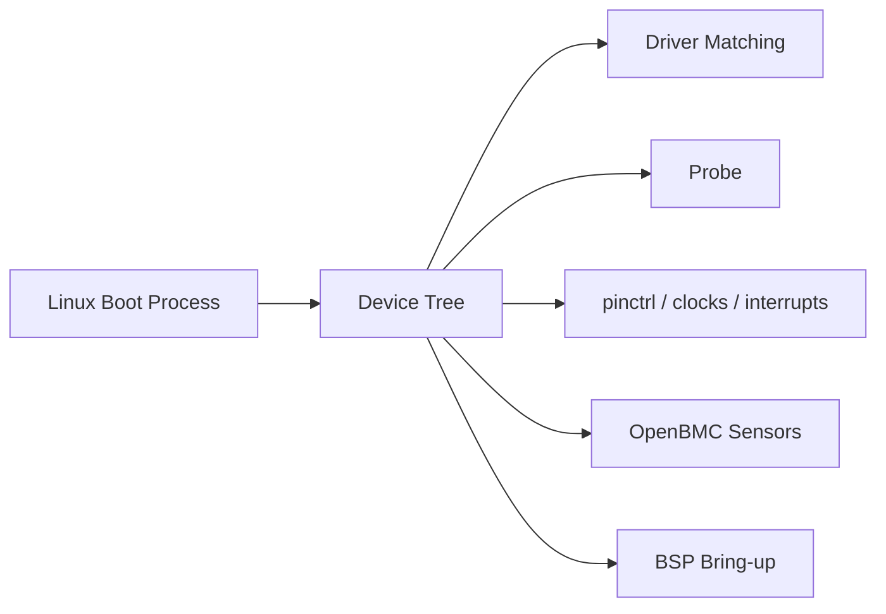
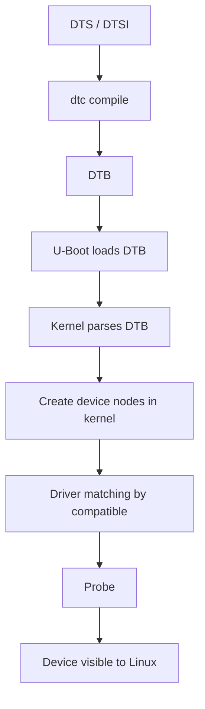
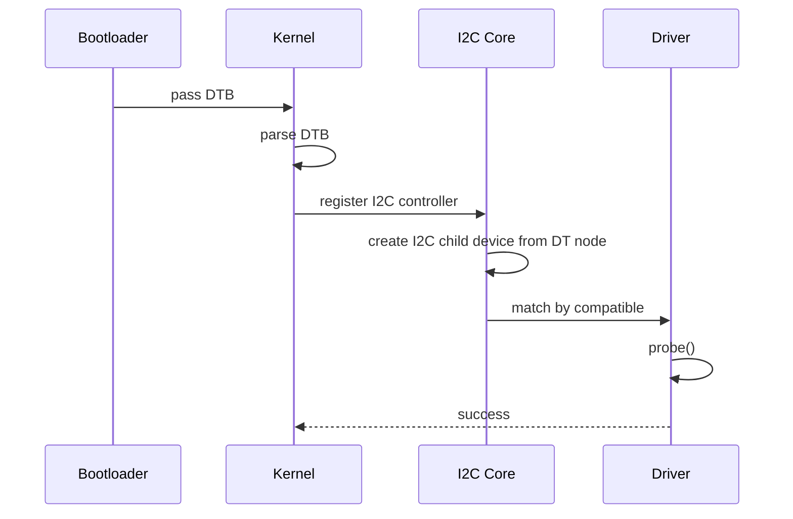

## Metadata

| Item | Value |
| --- | --- |
| Category | Linux Internals / BSP |
| Difficulty | Intermediate |
| Importance | High |
| Interview Frequency | High |
| Related Topics | Linux Boot Process, U-Boot, Linux Driver Model, I2C, pinctrl, clocks, OpenBMC Sensor Stack |

## 一句話總結

Device Tree 的核心價值，是把「這塊 board 上到底接了什麼硬體、它們在哪裡、怎麼接」從 driver code 裡拆出來，讓同一份 kernel 與 driver 可以支援多個不同板子，而不用把 board-specific 邏輯硬寫進 driver。

## 關鍵名詞速查

| Term | One-line Explanation |
| --- | --- |
| DTS | `Device Tree Source`，人可讀的裝置描述原始檔。 |
| DTSI | 可被多個 DTS 共用的 include 檔，通常放 SoC 或共用 board fragment。 |
| DTB | `Device Tree Blob`，編譯後交給 bootloader / kernel 使用的 binary。 |
| node | Device Tree 裡的一個硬體或邏輯描述節點。 |
| compatible | driver matching 的關鍵字，表示這個 node 應該由哪類 driver 處理。 |
| reg | device 使用的 address / size 資訊。 |
| interrupts | device 使用的 interrupt 資訊。 |
| clocks | device 相依的 clock 資源。 |
| pinctrl | device 使用的 pin multiplexing 設定。 |
| aliases | 給常見裝置一個穩定別名，例如 `serial0`、`i2c0`。 |
| chosen | boot-time 相關資訊節點，例如 `bootargs`、`stdout-path`。 |
| reserved-memory | 保留給特定用途、不能被一般 memory allocator 隨便用的記憶體區域。 |
| of_match_table | Linux driver 用來和 Device Tree `compatible` 做 matching 的表。 |
| probe | driver 真正開始初始化 device 的函式。 |
| phandle | Device Tree 裡節點之間互相引用的方式。 |

## Knowledge Map

### 1. Prerequisite knowledge

要真正看懂這個主題，前面最好先有：

- Linux Boot Process 的整體概念
- bootloader 與 kernel 的角色差異
- I2C / SPI / GPIO / clock / interrupt 的基本觀念
- driver 與 device 分工的概念

### 2. Related topics

這篇和下面主題會直接連在一起：

- `03-linux-boot-process.md`
- `05-linux-driver-model.md`
- `06-u-boot.md`
- I2C sensor bring-up
- pinctrl / clock / reset controller

### 3. What should be learned next

看完 Device Tree 後，最適合接著學的是：

1. Linux Driver Model
2. U-Boot
3. I2C / SPI bus 架構
4. GPIO / pinctrl / clock framework

因為實際 BSP debug 很少只停在 DTS 檔本身，通常會一路連到 driver probe 與資源 framework。

### 4. How this topic is used in OpenBMC

在 OpenBMC 裡，Device Tree 很常決定：

- 哪些 I2C sensor 會被 kernel 看到
- 哪些 bus、mux、GPIO expander 會被建立
- watchdog、fan controller、EEPROM、flash controller 是否能正常 probe
- console 與 bootargs 是否正確

### 5. How this topic is used in BSP development

在 BSP 開發裡，Device Tree 幾乎是 daily work：

- 新 board bring-up 時補 node
- board revision 改版後更新 pinctrl / GPIO / regulator
- 換 sensor / mux / clock source 時修改 DTS
- debug 某個 driver 為什麼不 probe

### 6. How this topic appears in firmware interviews

面試很常問的不是語法，而是這幾個點：

- 為什麼 Linux 要有 Device Tree
- `compatible` 怎麼 match 到 driver
- `DTS` / `DTSI` / `DTB` 差在哪
- driver 為什麼不應該硬編碼 board-specific address
- 某個 I2C sensor 為什麼在 Linux 裡看不到



## 為什麼重要

Device Tree 存在，不是因為 Linux 想把設定檔做得很花，而是因為它要解一個很實際的工程問題：

同一顆 SoC 可以做很多不同板子，但 board 上的硬體接法往往不同。

例如同樣是 AST2600 平台：

- 有些板子 sensor 掛在 `i2c3`
- 有些板子掛在 `i2c7`
- 有些板子多了一層 I2C mux
- 有些板子 watchdog、fan controller、GPIO expander 型號不同
- 某些板子 UART console 走 `uart5`
- 某些板子 rootfs flash layout 也不同

如果沒有 Device Tree，通常只剩兩種很差的做法：

1. 把 board-specific 資訊硬寫進 driver
2. 每換一塊板子就改一版 kernel code

這樣會帶來很多問題：

- driver 不可重用
- kernel code 充滿 `if (board == X)` 這種邏輯
- 同一個 driver 支援多板時維護成本很高
- bring-up 變得很容易碰到 side effect

Device Tree 解的是「硬體描述」和「driver 行為」分工問題：

- Device Tree 描述硬體是什麼、接在哪、依賴什麼資源
- driver 負責知道怎麼操作這類 hardware

如果這個機制不存在，Linux 在 ARM / Embedded Linux 世界幾乎很難維持現在這種 board scalability。

## 核心觀念

### 1. Device Tree 描述的是 hardware topology，不是 runtime policy

它比較像在回答：

- 這顆 device 存不存在
- 它的 base address 在哪
- 它用哪個 interrupt
- 它吃哪個 clock
- 它的 pinmux 該怎麼切

而不是在回答：

- service 要不要 restart
- sensor alarm policy 怎麼做
- Web UI 要不要顯示某個欄位

這也是為什麼 Device Tree 應該描述硬體，而不是塞太多產品策略。

### 2. Device Tree 把 SoC-level 與 board-level 資訊拆開

這就是 `DTSI` 很重要的原因。

常見分工是：

- SoC `.dtsi`：描述 SoC 裡有哪些 controller，例如 I2C controller、UART、GPIO、timer
- board `.dts`：描述這塊板子實際把哪些 controller 接出來、掛了哪些外部 device

這樣設計的好處是：

- SoC 共通部分可重用
- board 差異集中在 `.dts`
- 換板子時不用大量動 kernel driver

### 3. Driver matching 的核心是 `compatible`

對 Linux 來說，Device Tree 不是「拿來看看的文字檔」，而是用來建立 device 與 driver 對應關係。

例如：

- Device Tree node 寫 `compatible = "tmp75";`
- I2C driver 的 `of_match_table` 也列出 `"tmp75"`

那 kernel 在適當 bus 上建立 device 時，就有機會把這顆 device 配對給對應 driver。

如果沒有 `compatible` 這層：

- kernel 不知道哪個 driver 該處理這個 node
- 很多 platform / I2C / SPI 裝置就只能靠 board file 硬綁

### 4. 一顆 device 要「被 Linux 看見」，不是只有 DT 有 node 就夠

這是 BSP debug 常見誤區。

一顆 device 真正出現在 Linux 裡，通常至少經過這些條件：

1. bootloader 把正確 DTB 交給 kernel
2. kernel 成功 parse DTB
3. parent bus controller 自己先 probe 成功
4. 該 node 狀態不是 disabled
5. `compatible` 能 match 到 driver
6. driver 需要的資源都能拿到
7. `probe()` 本身沒有失敗

所以「driver 沒起來」不一定代表 driver 本身壞了，很多時候只是前面某一層 handoff 沒接上。

### 5. Device Tree 不是取代 driver，而是讓 driver 保持 generic

driver 還是要知道：

- register 怎麼操作
- 狀態怎麼初始化
- interrupt 怎麼處理

Device Tree 不會幫你寫 driver。  
它只是把 board-specific 參數從 driver code 裡拿掉。

### 6. `chosen`、`aliases`、`reserved-memory` 不是 peripheral node，但很重要

很多新手會只看 device node，忽略這些 system-level 節點。

但在實務上：

- `chosen` 常影響 console / bootargs
- `aliases` 常影響裝置命名穩定性
- `reserved-memory` 會影響 DMA、共享記憶體、特定 firmware buffer

這些都是 boot 與 bring-up 常見 debug 點。

## 比較表

| 項目 | 角色 | 主要內容 | 常見用途 | 出錯時常見症狀 |
| --- | --- | --- | --- | --- |
| DTS | 人可讀 board/source 檔 | 板級硬體描述 | BSP 開發、review、修改 | 編譯前就看得到錯 |
| DTSI | 共用 include 檔 | SoC 或共用 fragment | 多板共用基底 | 共用設定錯會影響多板 |
| DTB | 編譯後 binary | kernel / bootloader 讀的 blob | 實際 boot handoff | 用錯 DTB 時 driver 大量不 probe |
| `compatible` | driver matching key | 裝置型號/相容字串 | 找到正確 driver | node 存在但沒有 driver 接 |
| `reg` | address / size 描述 | MMIO 或 bus address | controller / peripheral mapping | base address 錯、讀不到硬體 |
| `interrupts` | 中斷描述 | IRQ line / type | interrupt-driven device | probe 成功但事件完全不動 |
| `clocks` | clock 依賴描述 | clock provider reference | peripheral enable | device probe fail 或 timeout |
| `pinctrl` | pin mux / electrical setup | pin state reference | UART / I2C / SPI / GPIO | peripheral 不通、console 沒字 |
| `chosen` | boot-time 系統資訊 | `bootargs` / `stdout-path` | early boot / console | `Starting kernel...` 後沒 log |
| `reserved-memory` | 保留記憶體描述 | shared / DMA / firmware buffer | 特殊記憶體用途 | memory overlap、DMA 問題 |

## Linux 如何實作

### 1. DTS / DTSI 先被編成 DTB

build 時會經過 `dtc`：

- `.dts`
- include `.dtsi`
- 最後產生 `.dtb`

這一步的本質是把人類比較好維護的樹狀描述，轉成 bootloader / kernel 可讀的 binary format。

### 2. bootloader 把 DTB 交給 kernel

常見情境是：

- `U-Boot` 載入 kernel image
- 再載入對應 DTB
- 最後一起 handoff 給 kernel

如果這裡交錯檔，後面問題會很隱晦。  
最常見就是：

- board A 跑了 board B 的 DTB
- kernel 有起來，但 device tree-based peripherals 幾乎都怪怪的

### 3. kernel 早期把 flattened DTB 轉成 internal tree

kernel 在 early boot 會先 parse DTB，建立自己的 internal representation。  
這一步之後，很多 subsystem 才能開始用 OF API 查資料，例如：

- `of_property_read_u32()`
- `of_get_named_gpio()`
- `of_irq_get()`
- `devm_clk_get()`

### 4. platform / bus device 會根據 DT node 被建立

不同類型裝置有不同路徑：

- SoC controller 常走 platform device 路徑
- I2C child device 由 I2C core 根據 child node 建立
- SPI child device 由 SPI core 建立

這也是為什麼 parent bus controller 必須先活著，child device 才有機會出現。

### 5. driver 用 `of_match_table` 做 matching

這是最核心的 Linux 實作點之一。

當 kernel 建出某個 device 後，會看：

- 這個 device 的 `compatible` 是什麼
- 哪些 driver 宣告自己支援這些 `compatible`

match 成功後，才會進到 driver `probe()`。

### 6. `probe()` 不是一定成功，DT 只是讓它有機會開始

match 到 driver 之後，還要過好幾關：

- `reg` 是否正確
- `interrupts` 是否正確
- `clocks` 是否拿得到
- `pinctrl` 是否套上
- dependency provider 是否已 ready

這也是為什麼很多 log 會看到：

- `probe deferred`
- `-EPROBE_DEFER`
- `failed to get clock`
- `invalid GPIO`

### 7. deferred probe 是 BSP debug 常客

這個機制存在是因為 Linux driver 初始化順序不可能永遠一次就剛好。

例如一個 sensor driver 需要：

- I2C bus ready
- regulator ready
- pinctrl ready

如果其中一個 provider 還沒起來，kernel 可能先 defer，等後面再 probe。

如果這個機制不存在：

- 很多有 dependency 的 driver 只能硬依賴固定初始化順序
- 系統彈性會很差

## OpenBMC / BMC 實際案例

### 案例 1：I2C sensor 為什麼沒出現在 `/sys/class/hwmon`

OpenBMC 上非常常見的現象是：

- `phosphor-hwmon` 沒看到某顆 sensor
- Redfish 沒這顆 sensor
- `/sys/class/hwmon` 也沒有對應項目

常見根因其實不是 `phosphor-hwmon`，而是：

- DT 裡根本沒這顆 sensor node
- `compatible` 寫錯
- sensor 掛的 I2C bus 不對
- I2C mux node 沒建好
- parent bus controller 自己就沒 probe 起來

### 案例 2：UART console 沒字，不一定是 UART driver 壞

如果你在 BMC bring-up 時看到：

- kernel 似乎在跑
- 但 serial console 沒字

除了 driver 本身，也很常是 DT 問題：

- `pinctrl` 錯
- `chosen/stdout-path` 錯
- `aliases` 對應錯
- UART node 狀態是 `disabled`

### 案例 3：GPIO expander 掛了，連帶很多裝置都看不到

在 BMC 板子上很常有：

- I2C GPIO expander
- reset line 經過 expander 控制
- 某些 device enable pin 也經過 expander

如果這個 expander 自己的 DT 有問題，表面症狀可能是：

- 看起來像很多裝置同時壞掉
- 但根因只是一個上游 dependency 沒起來

### 案例 4：reserved-memory 配錯，症狀不一定在 boot 當下爆

有些 BMC / Embedded Linux 平台會保留某些 memory 給：

- DMA
- shared buffer
- firmware / co-processor

如果 `reserved-memory` 描述不對，可能不是一開機就 panic，而是：

- 某些 driver 在 runtime 才出怪問題
- memory corruption 看起來像隨機

這也是為什麼 DT 問題不一定都長得像「driver 沒 probe」。

## Mermaid 圖解





## 程式範例

### 1. OpenBMC 常見 I2C sensor DTS 範例

```dts
&i2c3 {
    status = "okay";

    tmp75@4d {
        compatible = "ti,tmp75";
        reg = <0x4d>;
    };
};
```

這段真正表達的是：

- `i2c3` 這條 bus 要打開
- bus 上有一顆位址 `0x4d` 的 sensor
- 它應該由支援 `"ti,tmp75"` 的 driver 來處理

### 2. `chosen` 與 `aliases` 範例

```dts
/ {
    aliases {
        serial0 = &uart5;
        i2c0 = &i2c3;
    };

    chosen {
        stdout-path = "serial0:115200n8";
    };
};
```

這常直接影響：

- kernel console 從哪個 UART 出
- 某些系統元件怎麼引用預設裝置

### 3. driver `of_match_table` 範例

```c
static const struct of_device_id tmp75_of_match[] = {
    { .compatible = "ti,tmp75" },
    { }
};
MODULE_DEVICE_TABLE(of, tmp75_of_match);

static struct i2c_driver tmp75_driver = {
    .driver = {
        .name = "tmp75",
        .of_match_table = tmp75_of_match,
    },
    .probe = tmp75_probe,
};
```

這段的重點不是語法，而是：

- DT node 提供 `compatible`
- driver 宣告自己支援哪些 `compatible`
- match 成功才會進 `probe`

## 常見 Debug 方法

### 1. 先確認 kernel 真的拿到哪份 DTB

這是最基本但也最常被跳過的一步。

先問：

- bootloader 實際載的是哪份 DTB？
- 這份 DTB 是不是你以為的那份？

如果一開始就拿錯檔，後面看 driver log 會很浪費時間。

### 2. 先看 parent bus 有沒有起來

很多人看到 child device 不見，就直接查 child driver。  
但實務上更常見的是 parent bus 根本沒起來。

例如：

- `i2c3` controller 沒 probe
- I2C mux 沒建起來
- SPI controller status 還是 disabled

### 3. 從 `compatible -> of_match_table -> probe()` 這條線查

這是最穩的思路：

1. DTS node 在不在
2. `compatible` 對不對
3. driver 有沒有支援這個 `compatible`
4. 有沒有進 `probe`
5. `probe` 失敗在哪

### 4. 善用 `/proc/device-tree` 與 kernel log

很實用的方式：

- 看 `/proc/device-tree/`
- 看 `dmesg`
- 看 driver 是否有 `probe deferred`

這能幫你區分：

- DT 根本沒進去
- node 有進去但沒 match
- match 了但 probe fail

### 5. 常見 BSP debug 切法

| 現象 | 先查什麼 |
| --- | --- |
| device 完全看不到 | node 在不在、status 是否 `okay` |
| node 在但 driver 沒起 | `compatible` 與 `of_match_table` |
| probe 有進但失敗 | `reg`、clock、interrupt、pinctrl、GPIO |
| 某整條 bus 都怪 | parent bus controller / mux / pinctrl |
| console 沒字 | `chosen`、`aliases`、UART pinctrl |
| runtime 才亂掉 | `reserved-memory`、DMA、dependency provider |

### 6. 如果是 OpenBMC sensor 問題，先切 kernel 與 user space 邊界

先問：

- kernel 有沒有建立對應 hwmon / device node？

如果沒有，優先查 DT / driver。  
如果有，再去查：

- `phosphor-hwmon`
- entity-manager
- D-Bus object

這樣才不會一開始就查錯層。

## 常見誤解

### 1. Device Tree 就是 Linux 的硬體設定檔

不夠精確。  
它不是單純設定檔，而是 bootloader 與 kernel 共同使用的硬體描述資料。

### 2. 只要 DTS 有 node，device 就一定會出現

錯。  
還要 parent bus ready、matching 成功、probe 成功。

### 3. `compatible` 只是字串，寫差不多就好

錯。  
這通常是 driver matching 的核心 key，差一個字就可能完全不會 match。

### 4. Device Tree 可以取代 driver

不行。  
DT 只描述硬體，不知道怎麼操作 register 與處理 runtime 行為。

### 5. `status = "okay"` 就表示硬體一定正常

不是。  
它只表示這個 node 沒被 disable，不代表實體硬體、clock、GPIO、power 都真的沒問題。

### 6. OpenBMC sensor 問題通常是 user space 問題

不一定。  
很多 sensor 問題其實在 DT / bus / kernel driver 這一層就已經決定了。

## 常見面試題

### 1. 為什麼 Linux 需要 Device Tree？

預期要講出：

- 將 board-specific hardware description 從 driver 拆開
- 讓同一份 kernel 支援多板
- 避免 driver 充滿硬編碼 board 差異

### 2. `DTS`、`DTSI`、`DTB` 差在哪？

這題其實在看你有沒有實作經驗：

- `DTS`：板級 source
- `DTSI`：共用 include
- `DTB`：編譯後 binary，實際交給 bootloader / kernel

### 3. `compatible` 是做什麼的？

應該回答：

- 它是 device 與 driver matching 的關鍵
- Linux 會依它去找 `of_match_table`

### 4. 一顆 device 如何從 DT 變成 Linux 裡可見的裝置？

面試官通常期待你能講出完整鏈：

- DTB 被帶進 kernel
- kernel parse node
- parent bus 建立 child device
- driver 依 `compatible` match
- `probe()` 成功後 device 才真正可用

### 5. 如果 driver 沒有 probe，你會怎麼查？

這題重點是 debug 流程，不是背 API：

- node 在不在
- `status`
- `compatible`
- `of_match_table`
- dependency resource
- `probe deferred`

### 6. `chosen`、`aliases`、`reserved-memory` 各自常用在哪？

這題可以看出你不是只會看 peripheral node。

### 7. OpenBMC 上某顆 I2C sensor 看不到，你會先查哪裡？

比較好的回答是：

- parent I2C bus
- mux
- DT node
- `compatible`
- kernel driver / hwmon
- 最後才是 D-Bus / `phosphor-hwmon`

### 8. 為什麼 driver 不應該硬編碼某個 board 的 I2C address 或 GPIO pin？

核心理由是：

- driver 應該 generic
- board 差異應由 DT 描述
- 否則 driver 無法擴充與重用

## Firmware Interview Takeaway

如果面試官在 BSP / Embedded Linux / OpenBMC 面試裡問 Device Tree，通常期待的不是你背出所有 property，而是你至少要能展示這些理解：

1. 知道 Device Tree 為什麼存在  
   它解的是 board-specific 硬體描述和 generic driver 分工問題。

2. 知道 `DTS` / `DTSI` / `DTB` 的角色差異  
   這反映你有沒有真正碰過 build 與 boot handoff。

3. 知道 `compatible` 與 `of_match_table` 怎麼讓 driver match 成功  
   這是「硬體怎麼被 Linux 看見」的關鍵。

4. 知道 device visible 不是只靠 node 存在  
   parent bus、resource、probe 都要成立。

5. 能用 OpenBMC / I2C sensor / mux / GPIO expander 這種實例說明  
   這比抽象定義更像實戰經驗。

如果要用一句比較像 3-5 年 firmware engineer 的回答，我會這樣講：

> Device Tree 不是單純的硬體設定檔，而是 Linux 在 Embedded 世界拿來解耦 board description 與 driver 的核心機制。真正重要的不是背 property 名字，而是知道一個 node 怎麼被帶進 kernel、怎麼 match driver、怎麼進 probe，以及哪一層壞掉會讓裝置最後看不見。

## 我的理解

我現在會把 Device Tree 看成 Linux 在 Embedded 平台上的「硬體地圖」。

這張地圖不負責教 driver 怎麼工作，  
它負責回答：

- 這裡有沒有這顆硬體
- 它接在哪裡
- 它需要哪些資源
- 哪個 driver 應該來處理它

從 firmware 工程角度，這個主題最有價值的地方是：

- 它讓我知道問題到底在 board description 還是 driver 本身
- 它讓我 debug sensor / bus / console 問題時不會一開始就查錯層
- 它讓我在看 OpenBMC 問題時，先問「kernel 這層有沒有先把硬體看見」

如果能用這種方式理解 Device Tree，後面學 U-Boot、driver model、OpenBMC sensor stack 都會順很多。

## 延伸閱讀

- Linux kernel `Documentation/devicetree/`
- Linux kernel `Documentation/devicetree/bindings/`
- `dtc` man page
- U-Boot Device Tree 相關文件
- Linux kernel `drivers/of/`
- Linux kernel `Documentation/driver-api/`
- OpenBMC sensor / hwmon 相關文件
- SoC 與 board 對應的 `.dtsi` / `.dts`
