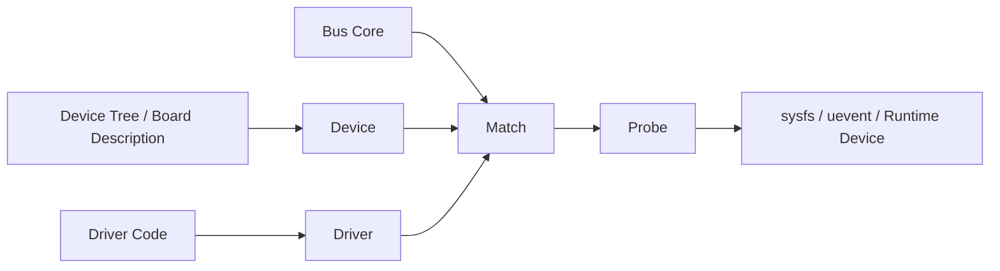
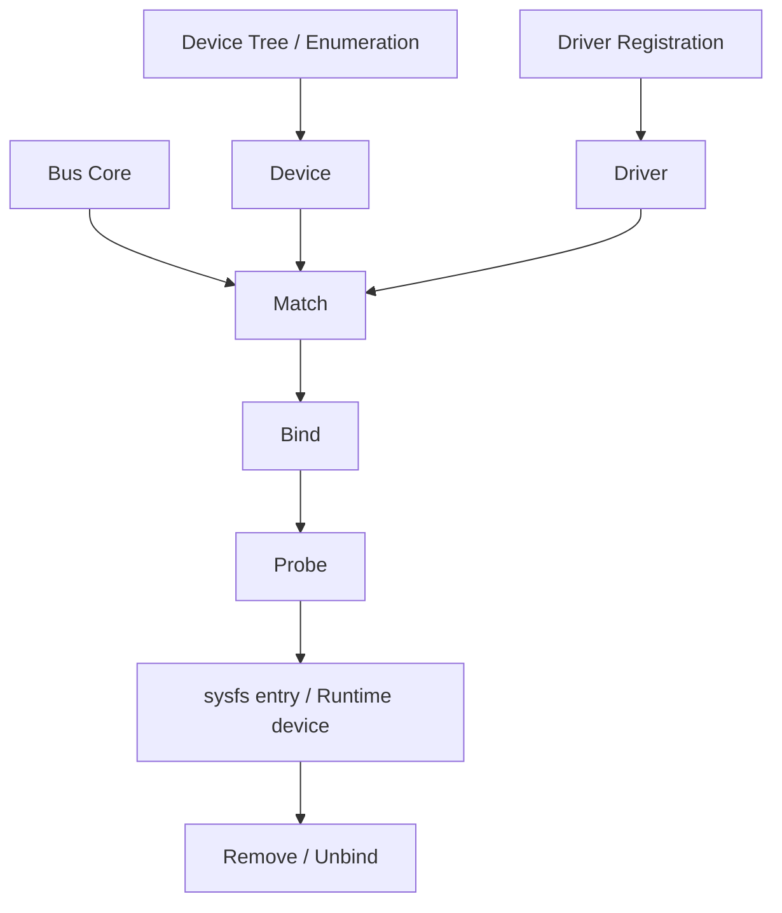
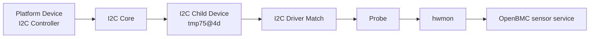

## Metadata

| Item | Value |
| --- | --- |
| Category | Linux Internals / BSP |
| Difficulty | Intermediate |
| Importance | High |
| Interview Frequency | High |
| Related Topics | Linux Boot Process, Device Tree, I2C, SPI, Platform Driver, sysfs, uevent, OpenBMC Sensor Stack |

## 一句話總結

Linux Driver Model 的核心不是「driver 怎麼寫」，而是 Linux 怎麼用一致的方式把 `device`、`driver`、`bus` 串起來，讓正確的硬體能被正確的 driver 接手，並且能被系統觀察、管理與除錯。

## 關鍵名詞速查

| Term | One-line Explanation |
| --- | --- |
| Device | Linux 眼中一個可被管理的硬體實體或邏輯裝置。 |
| Driver | 負責操作某一類硬體的程式碼。 |
| Bus | Device 與 Driver 相遇、列舉與管理的框架或通道。 |
| Match | kernel 判斷某個 device 應該交給哪個 driver 的過程。 |
| Probe | driver 真正接手 device 並初始化它的函式。 |
| Remove | device 被移除或 driver 卸載時的清理函式。 |
| Platform Device | 不經可熱插拔匯流排列舉、通常由 SoC / Device Tree 描述的裝置。 |
| I2C Device | 掛在 I2C bus 上，由 I2C core 與 driver model 管理的裝置。 |
| SPI Device | 掛在 SPI bus 上，由 SPI core 與 driver model 管理的裝置。 |
| sysfs | kernel 把 device / driver / bus 關係暴露給 user space 的檔案介面。 |
| uevent | kernel 在裝置新增、移除、bind 等事件時送給 user space 的通知。 |
| Device Tree Matching | 用 `compatible` 與 `of_match_table` 進行的 matching 機制。 |
| Deferred Probe | 依賴資源還沒 ready 時，driver 暫時延後 probe 的機制。 |

## Knowledge Map

### 1. Prerequisite knowledge

看這篇前最好先有：

- Linux Boot Process
- Device Tree 基本概念
- I2C / SPI / MMIO 基本觀念
- User Space vs Kernel Space

### 2. Related topics

這篇會直接連到：

- `04-device-tree.md`
- `06-u-boot.md`
- I2C sensor bring-up
- pinctrl / clock / reset framework
- `15-linux-debugging.md`

### 3. What should be learned next

看完這篇後，最適合接著學：

1. I2C / SPI bus 細節
2. sysfs 與 uevent 路徑
3. Deferred probe 與 dependency framework
4. OpenBMC sensor stack 與 hwmon

### 4. How this topic is used in OpenBMC

在 OpenBMC 裡，這個主題直接影響：

- I2C sensor 是否被 kernel 正確建立
- GPIO expander、watchdog、fan controller 是否有成功 probe
- `/sys/class/hwmon`、`/sys/bus/i2c/devices` 是否出現預期裝置
- 上層 `phosphor-hwmon`、entity-manager、`bmcweb` 能不能看到底層硬體

### 5. How this topic is used in BSP development

在 BSP bring-up 裡，這個主題會出現在：

- 新 device node 加進 DTS 後，為什麼還是沒 probe
- 某個 platform driver 為什麼沒 match
- I2C / SPI child device 為什麼看不到
- 某個 driver 一直 `-EPROBE_DEFER`

### 6. How this topic appears in firmware interviews

面試官常不只問「什麼是 driver」，而是想看你能不能回答：

- `device`、`driver`、`bus` 三者關係
- platform driver 與 I2C / SPI driver 的差異
- Device Tree 如何參與 matching
- 為什麼有 match 還不一定 probe 成功
- 怎麼沿著 sysfs / dmesg debug



## 為什麼重要

Linux 不是只有「driver code」而已，它還需要一套機制回答下面這些問題：

- 這個硬體在系統裡怎麼表示？
- 它應該交給哪個 driver？
- 什麼時候開始初始化？
- 移除時誰來清理？
- user space 要去哪裡看到它？

如果沒有 Linux Driver Model，實際上會很混亂：

- 每個 subsystem 都自己發明一套 device / driver 管理方式
- driver matching 變成各寫各的
- sysfs / hotplug / power management 很難統一
- BSP debug 時幾乎沒有一致的觀察介面

Linux Driver Model 存在就是為了把這件事統一：

- 用一致的 `device` 物件表示硬體
- 用一致的 `driver` 物件表示驅動程式
- 用 `bus` 當作它們相遇、match、probe 的框架

這個設計的價值，在 Embedded Linux 特別大，因為我們常常同時面對：

- SoC 內建 peripheral
- I2C / SPI 外部 device
- board-specific wiring
- 多層 dependency

如果沒有這套模型，driver 雖然也能「勉強寫出來」，但系統很難維護、更難 debug。

## 核心觀念

### 1. Linux Device Model 是在抽象「系統裡有哪些可管理實體」

從第一原理看，kernel 必須先有「系統裡這個硬體是誰」的表示法，才能談：

- 它要交給誰管
- 它依賴哪些資源
- 它目前狀態如何
- 它怎麼暴露到 sysfs

所以 `device` 的意義不是「一顆晶片而已」，而是：

> Linux 核心裡一個可以被識別、綁定、管理、觀察的裝置物件

### 2. Driver Model 把 `device`、`driver`、`bus` 三者拆開

這是整個主題最重要的心智模型。

- `device`：硬體實體或邏輯裝置
- `driver`：處理這類硬體的程式碼
- `bus`：負責列舉、管理、match 這些裝置

這樣拆開是為了解決什麼問題？

- 同一類 driver 可以處理多顆 device
- 同一個 bus 可以管理多個 child device
- 同一套 framework 可以支援不同匯流排

如果沒有這樣拆：

- driver 會和某個固定硬體綁死
- bus-specific 與 device-specific 邏輯會混在一起
- 整體可擴充性很差

### 3. Match 是「有沒有資格接手」，Probe 是「真正開始做事」

這兩個概念很常被混在一起。

更精確地說：

- `match`：kernel 判斷某個 driver 理論上能不能處理某個 device
- `probe`：match 成功後，driver 開始拿資源、設 register、做初始化

所以：

- 有 match，不代表一定 probe 成功
- 有 probe 被呼叫，也不代表最後成功完成初始化

這對 debug 很重要。

### 4. Platform Driver 解的是 SoC / board 內建裝置的管理問題

很多 Embedded Linux 裝置不是經過 PCIe 這種可列舉 bus 被發現，而是：

- SoC 本來就有 UART / I2C controller / timer / watchdog
- 這些東西的位置與 IRQ 通常由 Device Tree 描述

這時就需要 platform device / platform driver 這條路。

如果沒有 platform driver 模型：

- SoC 內建 controller 很難以一致方式交給 kernel 管理
- 每個 arch / board 都可能要自己處理大量板級硬編碼

### 5. I2C / SPI Driver 是「bus driver model 套在特定匯流排上的實作」

I2C 與 SPI 不只是 transport，它們也帶來自己的 device / driver 建立流程。

例如：

- I2C controller 本身常是 platform device
- 但掛在 controller 底下的 sensor 是 I2C device

這就形成兩層關係：

1. platform driver 把 I2C controller 帶起來
2. I2C core 再根據 DT / board info 建立 child I2C device
3. I2C driver 再對這些 child device 做 matching 與 probe

### 6. sysfs 讓 Driver Model 變成可觀察系統

這是 Linux 很實用的一點。

Driver Model 不只存在於 kernel 結構裡，還會透過 sysfs 讓你看到：

- 哪些 bus 存在
- 哪些 device 掛在哪裡
- 哪些 driver 已經 bind

沒有 sysfs 的話，很多 BSP debug 都只能靠猜。

### 7. uevent 讓 kernel 與 user space 對裝置事件有共同語言

當 device 新增、移除、bind、unbind 時，kernel 會發 uevent。

這解決的問題是：

- user space 不用不停 polling kernel 內部狀態
- 可以有一致的裝置事件通知路徑

在 desktop Linux 你常會想到 `udev`；在 Embedded / OpenBMC 雖然 user space 組合不同，但這條事件模型仍然重要。

### 8. Device Tree Matching 是 Embedded Linux 常見主路徑

在 BSP / OpenBMC 世界，最常見的 matching 問題都與 DT 有關。

例如：

- `compatible` 寫錯
- node `status = "disabled"`
- parent bus 沒起來
- resource 沒拿到

所以真正常見的 debug 問題通常不是「driver code 有沒有被編進去」而已，而是：

- device 有沒有先被建立
- matching 有沒有成功
- probe 為什麼失敗

## 比較表

| 面向 | Platform Driver | I2C Driver | SPI Driver |
| --- | --- | --- | --- |
| 典型裝置 | SoC controller、UART、watchdog、I2C master | 溫度 sensor、GPIO expander、EEPROM | SPI NOR、ADC、sensor、TPM |
| 裝置來源 | 多半由 Device Tree / platform data 描述 | 多半由 I2C core 根據 DT 建立 | 多半由 SPI core 根據 DT 建立 |
| 常見 matching | `of_match_table` / platform id | I2C device id + `of_match_table` | SPI device id + `of_match_table` |
| 常見 parent | platform bus | I2C adapter | SPI controller |
| OpenBMC 常見例子 | AST2600 I2C controller、UART、watchdog | TMP75、PCA95xx、EEPROM | SPI NOR flash、某些 peripheral |
| 常見 debug 重點 | `reg`、IRQ、clock、pinctrl | bus、address、mux、`compatible` | chip select、mode、clock、`compatible` |

## Linux 如何實作

### 1. 核心骨架是 `struct device`、`struct device_driver`、`struct bus_type`

從 kernel 架構看，Driver Model 的關鍵不是某一個函式，而是一套物件關係：

- `struct device`
- `struct device_driver`
- `struct bus_type`

這套設計存在是為了讓不同 subsystem 共用同一個「裝置生命週期模型」。

### 2. bus 負責管理 match / bind / unbind 流程

當一個 device 被註冊到某個 bus 上，bus core 會嘗試：

- 找可以處理它的 driver
- 執行 match
- match 成功後做 bind
- 最後進到 driver `probe`

如果之後 device 消失或 driver unload，則會走到 `remove`

### 3. Device 來源可以不一樣，但最後都會落進 driver model

這點很重要。

Linux 裡 device 不一定都來自同一種來源，例如：

- Device Tree
- ACPI
- board info
- 動態熱插拔列舉

但只要它最後變成 kernel 眼中的 device，就會進入 driver model 的管理範圍。

### 4. Platform device 常由 Device Tree 早期建立

對 Embedded Linux 而言，很多 SoC 內建 peripheral 在 early boot 時就會根據 DT 被建立成 platform device。

例如：

- `uart5`
- `i2c3`
- watchdog
- timer

之後 platform driver 再根據 `compatible` matching 接手。

### 5. I2C / SPI child device 往往是 bus controller probe 後才出現

這是 BSP debug 很重要的一個順序觀念。

如果 I2C controller 自己都還沒 probe 成功，後面的：

- `tmp75@4d`
- GPIO expander
- EEPROM

就根本不會出現在 I2C device list 裡。

所以 child device 看不到時，第一刀不一定是查 child driver。

### 6. `probe()` 裡面才是真正的 resource acquisition

driver `probe()` 裡通常會做：

- 讀取 DT property
- mapping register
- 取得 IRQ
- 取得 clock / reset / regulator
- 初始化硬體
- 註冊子系統介面，例如 hwmon / input / netdev

如果沒有 Driver Model 幫你把這一切放進一致生命週期裡：

- 資源釋放會很亂
- 錯誤回滾不好做
- bind / unbind 路徑很難維護

### 7. `remove()` 是容易被忽略但面試很愛問的部分

很多人以為 Embedded 系統不熱插拔，就不太需要看 `remove()`。  
但從模型上看，`remove()` 存在是必要的，因為：

- driver 可能 unload
- 裝置可能被移除
- 電源管理 / error recovery 有時也依賴乾淨的 teardown

在面試裡，如果你能說出：

- `probe()` 負責 bring-up
- `remove()` 負責 cleanup / unregister / free resources

就比只會講 probe 更完整。

### 8. sysfs 與 uevent 是 driver model 對外的觀察窗

這是工程上很有價值的一點。

你通常可以從：

- `/sys/bus/platform/devices`
- `/sys/bus/i2c/devices`
- `/sys/bus/spi/devices`
- `/sys/bus/*/drivers`

去看：

- device 有沒有被建立
- driver 有沒有存在
- bind 到誰

## OpenBMC / BMC 實際案例

### 案例 1：OpenBMC sensor 為什麼沒進 `/sys/class/hwmon`

表面看起來像 user space 問題，但很多時候根因在 driver model 這一層：

1. I2C controller 沒起來
2. I2C child device 沒被建立
3. `compatible` 沒 match 到 sensor driver
4. `probe()` fail
5. hwmon registration 沒成功

如果你一開始就查 `phosphor-hwmon`，常常會查錯層。

### 案例 2：GPIO expander 不見，很多下游裝置一起壞

在 BMC 板子上很常有 I2C GPIO expander。  
如果 expander driver 沒 probe 成功，表面症狀可能是：

- reset pin 沒拉起
- 某些 device enable pin 沒打開
- 下游 sensor / mux / peripheral 全部像壞掉一樣

但真正壞的只是前面一顆 expander。

### 案例 3：SPI NOR flash 有 node，但 MTD 沒出現

常見 debug 切法：

- SPI controller 自己有沒有 probe
- flash node 有沒有被建立成 SPI device
- `jedec,spi-nor` 類的 `compatible` 有沒有 match
- `probe()` 是否失敗在 mode / timing / CS

這題很適合拿來看你會不會分 platform controller 與 SPI child device。

### 案例 4：platform UART driver 有編進 kernel，但 console 還是沒字

這不一定是 driver code 問題，還可能是：

- DT node 沒 enable
- pinctrl 不對
- `chosen/stdout-path` 不對
- clock 沒拿到
- console path 根本沒綁到這顆 UART

這種題目很能反映你是不是用 driver model 的方式思考。

## Mermaid 圖解





## 程式範例

### 1. Platform Driver 基本骨架

```c
static const struct of_device_id ast_wdt_of_match[] = {
    { .compatible = "aspeed,ast2600-wdt" },
    { }
};
MODULE_DEVICE_TABLE(of, ast_wdt_of_match);

static int ast_wdt_probe(struct platform_device *pdev)
{
    /* map resource / get clock / init hardware */
    return 0;
}

static int ast_wdt_remove(struct platform_device *pdev)
{
    /* cleanup */
    return 0;
}

static struct platform_driver ast_wdt_driver = {
    .probe = ast_wdt_probe,
    .remove = ast_wdt_remove,
    .driver = {
        .name = "ast-wdt",
        .of_match_table = ast_wdt_of_match,
    },
};
module_platform_driver(ast_wdt_driver);
```

這段的重點不是語法，而是：

- DT node 會先變成 platform device
- `of_match_table` 決定能不能 match
- `probe()` 成功後 driver 才真正接手

### 2. I2C Driver 基本骨架

```c
static const struct of_device_id tmp75_of_match[] = {
    { .compatible = "ti,tmp75" },
    { }
};
MODULE_DEVICE_TABLE(of, tmp75_of_match);

static int tmp75_probe(struct i2c_client *client)
{
    /* read config / register hwmon / init sensor */
    return 0;
}

static void tmp75_remove(struct i2c_client *client)
{
    /* unregister hwmon / cleanup */
}

static struct i2c_driver tmp75_driver = {
    .driver = {
        .name = "tmp75",
        .of_match_table = tmp75_of_match,
    },
    .probe = tmp75_probe,
    .remove = tmp75_remove,
};
module_i2c_driver(tmp75_driver);
```

### 3. 常用 sysfs 觀察點

```bash
ls /sys/bus/platform/devices
ls /sys/bus/platform/drivers
ls /sys/bus/i2c/devices
ls /sys/bus/i2c/drivers
ls /sys/bus/spi/devices
```

這些路徑很適合用來回答三件事：

- device 有沒有被建立
- driver 有沒有註冊
- 兩者有沒有 bind 起來

## 常見 Debug 方法

### 1. 先分清楚是 `device 沒出現` 還是 `driver 沒接上`

這是最重要的第一刀。

如果 device 自己都還沒被建立，去看 driver `probe()` 沒太大意義。

### 2. 從 bus 往下查，不要直接跳到 leaf driver

例如 sensor 看不到時，先看：

- I2C controller 在不在
- bus number 對不對
- mux 有沒有起來
- child device 有沒有建立

再看 leaf driver。

### 3. 善用 `dmesg` 查 matching / probe fail

常見線索：

- `probe failed`
- `deferred probe pending`
- `failed to get clk`
- `irq not found`
- `invalid reg`

這些訊息常比 user space symptom 更接近 root cause。

### 4. 查 sysfs 的 bind / unbind 關係

很多時候你可以直接看：

- `/sys/bus/i2c/drivers/<driver>/`
- `/sys/bus/platform/drivers/<driver>/`

這能幫你回答：

- driver 有沒有註冊成功
- 目前 bind 到哪些 device

### 5. 如果是 DT-based 系統，先驗證 matching key

高頻問題通常是：

- `compatible` 錯
- node `status` 不是 `okay`
- parent resource 缺失

所以很多 BSP debug 真正第一刀不是看 C code，而是看 DTS / DTB。

### 6. OpenBMC 上的實務 debug 流程

如果某個硬體功能失效，我通常會這樣切：

1. 看 DT node 有沒有
2. 看 parent bus / controller 有沒有起來
3. 看 device 有沒有出現在 `/sys/bus/.../devices`
4. 看 driver 有沒有在 `/sys/bus/.../drivers`
5. 看 `dmesg` 裡 probe 有沒有失敗
6. 最後才看 user space service

這樣通常能少繞很多路。

## 常見誤解

### 1. Driver Model 就只是「driver 被載進 kernel」

不是。  
它更重要的是裝置表示、matching、probe、sysfs、uevent 與生命週期管理。

### 2. 有 `compatible` 就一定會 probe

不一定。  
matching 成功後，資源依賴還是可能讓 `probe()` fail 或 defer。

### 3. Platform Driver 比較低階，I2C / SPI Driver 比較高階

這種分法不準。  
它們是不同 bus / device 類型下的 driver model 實作，不是高低階關係。

### 4. sysfs 只是給 user space 看資料，和 driver model 無關

錯。  
sysfs 本來就是 driver model 的對外可觀察介面之一。

### 5. OpenBMC 上功能壞掉通常先查 service

不一定。  
很多問題其實更早在 device / driver matching 這一層就已經決定了。

## 常見面試題

### 1. 什麼是 Linux Device Model？

預期你能回答：

- Linux 用一致方式表示與管理 device / driver / bus 的框架
- 不只是寫 driver API，而是系統級裝置管理模型

### 2. `device`、`driver`、`bus` 三者關係是什麼？

這題通常是在看你有沒有真正抓到核心抽象。

### 3. `match` 與 `probe` 差在哪？

高品質回答應該能講出：

- match 是資格判斷
- probe 是真正初始化
- match 成功不代表 probe 一定成功

### 4. Platform Driver 是什麼？什麼情況會用？

應該提到：

- SoC 內建 peripheral
- 多半來自 Device Tree
- 常見如 UART、I2C controller、watchdog

### 5. I2C Driver 與 Platform Driver 差在哪？

面試官通常期待你說出：

- I2C child device 依附在 I2C adapter
- controller 自己常是 platform device
- 所以常常是兩層 driver model

### 6. 某個 device 為什麼沒有被正確 driver 接手？

要能從這幾個角度答：

- device 沒建立
- matching key 不對
- parent bus 沒 ready
- resource 缺失
- probe deferred / failed

### 7. sysfs 在 driver debug 上有什麼用？

重點不是背路徑，而是知道它能觀察：

- device 是否存在
- driver 是否註冊
- 是否已 bind

### 8. OpenBMC 上某顆 I2C sensor 不見，你會怎麼查？

這題很適合展示 debug mindset：

- 從 I2C controller / mux / child device / driver / hwmon / user space 一路切下去

## Firmware Interview Takeaway

如果這題出現在 BSP / Embedded Linux / OpenBMC 面試裡，通常面試官期待你至少具備這些理解：

1. 知道 Linux Driver Model 為什麼存在  
   它是用來統一 device / driver / bus 關係，不只是「寫 driver」而已。

2. 知道 `match -> probe -> remove` 是裝置生命週期的核心  
   而且知道 match 成功不代表 probe 必然成功。

3. 知道 platform、I2C、SPI 三種情境在模型上怎麼串起來  
   特別是在 BSP 上一個 controller 與 child device 常是兩層關係。

4. 知道 Device Tree 如何參與 matching  
   包含 `compatible`、resource、parent bus。

5. 知道如何用 sysfs、dmesg、DT、bus hierarchy 做 debug  
   這通常比背結構體欄位更像真正做過 BSP。

如果要用一句比較像 3-5 年 firmware engineer 的回答，我會這樣總結：

> Linux Driver Model 重要的不是 driver API 本身，而是它讓 Linux 能用一致方式把硬體表示成 device，把邏輯表示成 driver，再透過 bus 做 matching 與 probe。真正有工程價值的理解，是能沿著這條鏈快速判斷：裝置有沒有先出現、driver 有沒有 match、probe 為什麼失敗、問題停在 kernel 哪一層。

## 我的理解

我現在會把 Linux Driver Model 看成 Linux 裡的「裝置接線板」。

Device Tree 告訴 kernel：

- 這裡有什麼硬體
- 它掛在哪

Driver code 告訴 kernel：

- 我會處理哪類硬體
- 我拿到之後要怎麼初始化

Bus core 則負責：

- 讓兩邊相遇
- 做 matching
- 決定何時進 probe

這樣理解之後，我在 debug 時比較不會直接跳去看 user space symptom，而是會先問：

- 這個硬體有沒有先變成 Linux device？
- 它有沒有 match 到正確 driver？
- 它是沒 probe，還是 probe fail？

這個切法在 OpenBMC 和 BSP 都非常好用。

## 延伸閱讀

- Linux kernel `Documentation/driver-api/`
- Linux kernel `Documentation/i2c/`
- Linux kernel `Documentation/spi/`
- Linux kernel `Documentation/filesystems/sysfs.rst`
- Linux kernel `drivers/base/`
- Linux kernel `drivers/of/`
- OpenBMC hwmon / sensor 相關文件
- SoC / board 對應的 DTS 與 driver source code
