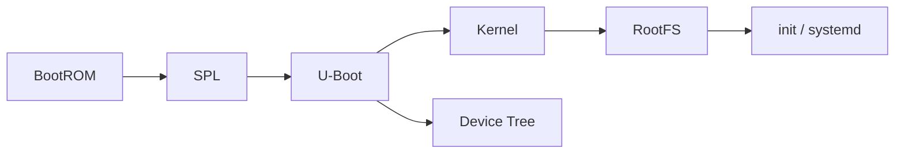
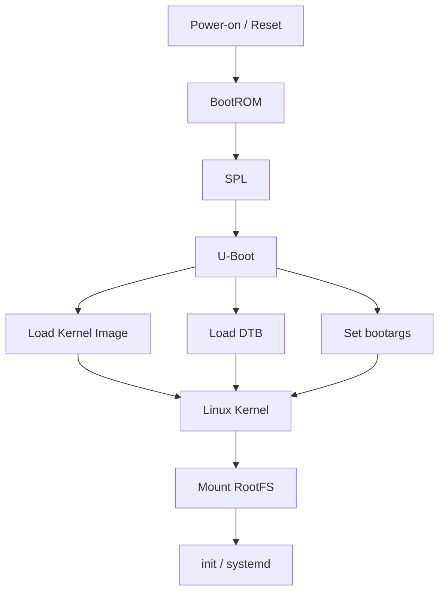
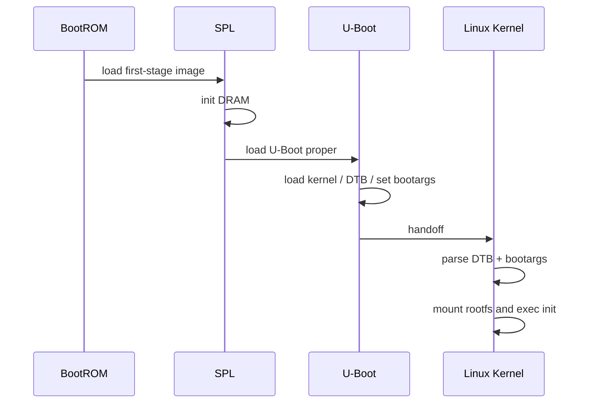

## Metadata

| Item | Value |
| --- | --- |
| Category | Linux Internals / BSP |
| Difficulty | Intermediate |
| Importance | High |
| Interview Frequency | High |
| Related Topics | Linux Boot Process, Device Tree, Linux Driver Model, BootROM, SPL, FIT Image, OpenBMC Bring-up |

## 一句話總結

U-Boot 的核心角色，是在 BootROM / SPL 已經把機器帶到「勉強能運作」的狀態後，接手完成較完整的硬體初始化、決定開機策略、載入 kernel 與 Device Tree，最後把控制權安全地交給 Linux。

## 關鍵名詞速查

| Term | One-line Explanation |
| --- | --- |
| BootROM | SoC 內建、不可修改的第一段啟動程式，負責找到下一段 boot image。 |
| SPL | `Secondary Program Loader`，先做最小化硬體初始化，特別是 DRAM bring-up。 |
| U-Boot | 常見的 Embedded Linux bootloader，負責 boot policy、image 載入與 handoff。 |
| Environment Variables | U-Boot 的執行期設定，例如 `bootcmd`、`bootargs`、`fdtfile`。 |
| bootargs | 傳給 Linux kernel 的 command line，例如 console、rootfs、debug 參數。 |
| bootcmd | U-Boot 預設執行的開機命令流程。 |
| FIT Image | `Flattened Image Tree`，可把 kernel、DTB、ramdisk 等包成單一 image。 |
| Device Tree | 描述 board hardware 的資料，讓 kernel 不必把板級資訊硬寫進 driver。 |
| Kernel Image | Linux kernel 本體，例如 `Image`、`zImage` 或 FIT 內的 kernel section。 |
| RootFS | kernel 啟動後要掛載的根檔案系統。 |
| Handoff | boot stage 之間交接控制權與關鍵資料的動作。 |
| Board Bring-up | 新板子第一次把 boot flow、console、kernel、driver 跑起來的過程。 |

## Knowledge Map

### 1. Prerequisite knowledge

看這篇前最好先有：

- Linux Boot Process 的整體概念
- BootROM / SPL / Device Tree 的基本角色
- kernel 與 rootfs 是不同層次的元件
- serial console 在 bring-up 裡的重要性

### 2. Related topics

這篇和下面主題會直接互相連動：

- `03-linux-boot-process.md`
- `04-device-tree.md`
- `05-linux-driver-model.md`
- rootfs / init / systemd
- OpenBMC image layout

### 3. What should be learned next

看完 U-Boot 之後，最值得往下接的是：

1. Device Tree handoff 細節
2. Linux kernel bootargs 與 early boot debug
3. rootfs mount 與 init 問題
4. SPI NOR / eMMC / network boot 實務

### 4. How this topic is used in OpenBMC

在 OpenBMC 裡，U-Boot 常常直接決定：

- 從哪個 flash layout 開機
- 使用哪份 DTB
- console 是否正確
- kernel command line 是否帶對
- A/B image、recovery、update path 如何切換

### 5. How this topic is used in BSP development

在 BSP bring-up 時，U-Boot 幾乎是第一個可操作的互動點：

- 先確認 DRAM 與 storage 是否可用
- 先確認 UART console 有沒有起來
- 手動載入 kernel / DTB 測試
- 快速驗證 bootargs、rootfs、DTB 是否正確

### 6. How this topic appears in firmware interviews

面試最常問的不是 U-Boot 指令背多少，而是：

- 為什麼 Linux 需要 bootloader
- SPL 與 U-Boot 各自做什麼
- U-Boot 怎麼載入 kernel / DTB
- `bootargs`、`bootcmd`、environment variables 的角色
- 停在 U-Boot prompt 或 `Starting kernel...` 時怎麼 debug



## 為什麼重要

Linux 不是上電後就能直接開始跑。  
在 power-on 當下，SoC 通常只具備很有限的能力：

- CPU 剛脫離 reset
- DRAM 不一定已初始化
- storage controller 不一定能直接用
- kernel image 不知道放在哪
- board-specific hardware 資訊還沒交給 kernel

這就是 bootloader 存在的原因。

從第一原理看，U-Boot 解決的是「在 kernel 能接手之前，誰來把系統帶到可以啟 kernel 的狀態」這個問題。  
如果沒有這一層，會發生幾件很麻煩的事：

- kernel 沒有穩定方式被載入
- board-specific boot policy 只能硬寫死在更早期 stage
- 無法靈活切換 boot source、bootargs、DTB
- board bring-up 缺少一個很重要的互動除錯點

對 Firmware / BSP 工程師來說，U-Boot 重要的地方不只是「把 Linux 啟起來」，而是它同時是：

- 開機鏈的關鍵 handoff stage
- 新板 bring-up 的第一個操作平台
- boot failure analysis 的重要切點
- 產品 boot policy 的落地位置

## 核心觀念

### 1. U-Boot 不是 BootROM，也不是 Linux kernel

BootROM 是 SoC 內建、不可修改的早期程式，責任通常很小。  
U-Boot 是可更新、可客製的 bootloader，責任更完整。  
Linux kernel 則是作業系統本體。

這三者常被混在一起，但其實分工很清楚：

- BootROM：至少把下一段程式找出來
- SPL：先把 DRAM 等最小硬體帶起來
- U-Boot：決定怎麼 boot、載哪些 image、帶哪些參數
- Kernel：建立 OS 執行環境

### 2. U-Boot 解的是「boot policy」與「image handoff」

SPL 的任務通常是把系統帶到「可以跑大一點的程式」。  
U-Boot 則接手更高層的決策，例如：

- 從 SPI NOR 還是 eMMC 啟動
- 要載哪份 kernel
- 要用哪份 DTB
- `bootargs` 怎麼組
- 要不要進 recovery mode
- 要不要改用 network boot

如果沒有 U-Boot，這些策略就只能：

- 硬塞到 BootROM 做不到的地方
- 或直接寫死在 kernel / image layout 中

這樣維護性會很差。

### 3. Environment Variables 是 U-Boot 的操作面

U-Boot 最有工程價值的一點，是它不是純黑盒子。  
它把很多 boot policy 暴露成 environment variables，例如：

- `bootcmd`
- `bootargs`
- `fdtfile`
- `kernel_addr_r`
- `fdt_addr_r`
- `boot_targets`

這解決的問題是：

- 不必每改一次 boot 流程就重新編整個 bootloader
- bring-up 時可以快速試不同組合
- recovery / fallback policy 比較容易實作

### 4. `bootargs` 是 U-Boot 與 kernel 之間非常關鍵的 handoff

很多新手會以為 U-Boot 只是「把 image 丟給 kernel」。  
其實 `bootargs` 常常決定 kernel 後面能不能正常工作，例如：

- `console=`
- `earlycon`
- `root=`
- `rootwait`
- `init=`
- `loglevel=`

如果這個 handoff 不存在，kernel 就很難在不同 board / storage / debug 場景下維持彈性。

### 5. Device Tree 通常也由 U-Boot 負責帶給 kernel

在很多 ARM / BMC 平台裡，kernel 並不是自己去找 DTB。  
通常是 U-Boot：

1. 載入 DTB
2. 視需要修改某些欄位
3. 再把 DTB 跟 kernel 一起 handoff

所以 DT 問題常常不是純 kernel 問題，也可能是 U-Boot 載錯檔、地址錯、或修改內容錯。

### 6. U-Boot 是 board bring-up 的第一個重要 debug 平台

新板 bring-up 時，你通常最早能互動的階段不是 kernel，而是 U-Boot prompt。

這時你可以先回答很多關鍵問題：

- DRAM 到底可不可用
- flash / eMMC 能不能讀
- console 有沒有正常
- DTB 是哪一份
- kernel image 載進記憶體了沒

這也是為什麼很多 BSP interview 會追問 U-Boot，而不只問 kernel。

## 比較表

| 階段 | 主要責任 | 是否可更新 | 常見輸入 | 常見輸出 | 失敗症狀 |
| --- | --- | --- | --- | --- | --- |
| BootROM | 找到第一段 boot image | 通常不可 | boot mode strap、flash header | SPL / 下一段 loader | 完全沒 log、掉 recovery |
| SPL | 最小硬體初始化，尤其 DRAM | 可 | BootROM 載入的 image | 可執行的 U-Boot proper | 卡在早期、DDR init fail |
| U-Boot | boot policy、載入 kernel / DTB、組 bootargs | 可 | DRAM、storage、env、image | kernel + DTB + bootargs handoff | 停在 U-Boot prompt、找不到 image |
| Linux Kernel | 建立 OS 執行環境 | 可 | kernel image、DTB、bootargs | rootfs、init、driver model | panic、mount rootfs fail |
| systemd / services | 啟動產品功能 | 可 | rootfs、PID 1、service graph | OpenBMC ready state | SSH 可進但服務不完整 |

## Linux 如何實作

### 1. BootROM 先載入 SPL，SPL 再載入 U-Boot proper

在很多 SoC 上，U-Boot 並不是上電後 CPU 第一個跑到的程式。

典型流程是：

1. BootROM 根據 boot source 設定從 SPI NOR / eMMC / NAND 等位置讀取 image
2. 先載入 SPL
3. SPL 完成 DRAM 初始化
4. SPL 再把 U-Boot proper 載進 DRAM

這樣設計的原因很直接：  
完整的 U-Boot 通常太大，沒辦法在 DRAM 還沒 ready 的情況下舒適地跑。

### 2. U-Boot 啟動後會建立自己的執行環境與 driver model

雖然它不是 Linux kernel，但它也有自己的：

- command interface
- environment storage
- storage / network / flash 支援
- 基本 device model
- image parser

它解決的是「在進 kernel 前，還需要一個能做實際操作與決策的平台」。

### 3. U-Boot 會決定 kernel、DTB、ramdisk 要怎麼被載入

常見流程可能是：

- 從 SPI NOR 讀 FIT image
- 從 eMMC 讀 `Image` 與 `*.dtb`
- 從 TFTP 抓 kernel / DTB

關鍵不是來源是哪一種，而是 U-Boot 需要負責：

- 讀到正確檔案
- 放到正確記憶體位置
- 用正確命令 handoff

### 4. `bootcmd` 是開機主流程的腳本入口

很多板子上電後會自動執行 `bootcmd`。  
你可以把它理解成：

> U-Boot 的預設開機腳本

它通常會包含：

- 選 boot source
- 載入 kernel / DTB
- 組 `bootargs`
- 執行 `bootm`、`booti` 或 `bootz`

如果 `bootcmd` 沒有這種機制，每塊板子的自動開機流程就會更難維護與調整。

### 5. `bootargs` 透過 `/chosen` 或 boot protocol 傳給 kernel

Linux kernel 啟動後，需要知道：

- console 在哪
- rootfs 在哪
- debug level 要多高
- 是否使用 earlycon

這些通常透過 command line 傳遞。  
U-Boot 會組好 `bootargs`，然後在 handoff 時一併帶進去。

### 6. FIT Image 是常見的整合載體

FIT Image 存在是為了解決多個 boot component 分開管理時的混亂問題。

它可以把：

- kernel
- DTB
- ramdisk
- checksum / signature

整合在同一個 image 裡。

這樣的好處是：

- 載入流程更一致
- image version 比較好對齊
- secure / verified boot 比較容易延伸

在 OpenBMC 或量產平台上，這種封裝方式很常見。

### 7. RootFS 通常不是 U-Boot 直接「執行」的，但它會影響 rootfs 能不能被 kernel 找到

U-Boot 自己不負責跑 `systemd`，但它常常決定 kernel 後續能不能掛上正確 rootfs，因為：

- `root=` 可能由它指定
- 儲存媒體模式可能由它先初始化
- 某些分區 layout / A-B slot 選擇也可能由它決定

所以看起來像 rootfs 問題，有時其實源頭在 U-Boot 的 boot policy。

## OpenBMC / BMC 實際案例

### 案例 1：BMC 上停在 U-Boot prompt，不代表 kernel 壞掉

如果板子上電後停在：

```text
U-Boot>
```

這通常代表：

- BootROM 與 SPL 大致已經過了
- DRAM 多半也至少基本可用
- 問題可能在 `bootcmd`、image、DTB、storage、environment

這種時候直接查 kernel driver 通常太早。

### 案例 2：OpenBMC 的 kernel 起不來，常見原因其實是 DTB 或 bootargs

表面現象可能是：

- 停在 `Starting kernel...`
- 沒有後續 console
- kernel 似乎沒反應

常見 root cause 包括：

- `console=` 設錯
- `earlycon` 沒開
- DTB 載錯 board
- `stdout-path` 不對
- kernel image / DTB load address 有誤

也就是說，這類問題未必是 Linux kernel 本體壞。

### 案例 3：BMC update 後無法正常開機，環境變數污染是高頻原因

有些平台把 environment 存在 flash。  
如果升級前後：

- `bootcmd`
- `bootargs`
- `boot_targets`
- slot selection 相關變數

沒有對齊，就可能出現：

- 明明 image 在，但 boot policy 還指到舊位置
- recovery 路徑一直被觸發
- kernel 能手動 boot，但自動 boot 失敗

### 案例 4：SPI NOR 可讀，但系統還是 boot 不起來

這在 bring-up 裡很常見。  
能讀 flash 不代表 boot flow 一定正確，還要看：

- image format 對不對
- FIT config 是否選對
- DTB 是否是正確 board
- `bootargs` 是否能讓 kernel 找到 rootfs

### 案例 5：Board Bring-up 初期，U-Boot 是最快的驗證平台

很多事情不需要等 Linux 起來才知道：

- `md` / `mw` 可以看記憶體
- `sf probe` 可以確認 SPI flash
- `mmc info` 可以確認 eMMC
- `fdt addr` / `fdt print` 可以看 DTB 內容

這讓你可以在 kernel 之前先切掉一大塊問題範圍。

## Mermaid 圖解





## 程式範例

### 1. 常見 environment variables

```bash
printenv bootcmd
printenv bootargs
printenv fdtfile
printenv boot_targets
```

這幾個變數通常就足夠回答很多問題：

- 自動開機流程是什麼
- kernel command line 是什麼
- 目前用哪份 DTB
- U-Boot 會從哪些裝置嘗試 boot

### 2. 手動載入 kernel 與 DTB 的概念範例

```bash
setenv bootargs 'console=ttyS4,115200 root=/dev/mmcblk0p2 rw rootwait'
load mmc 0:1 ${kernel_addr_r} Image
load mmc 0:1 ${fdt_addr_r} aspeed-bmc-board.dtb
booti ${kernel_addr_r} - ${fdt_addr_r}
```

這段最重要的不是指令本身，而是理解：

- kernel image 在哪
- DTB 在哪
- `bootargs` 怎麼帶
- 最後用哪個 boot command handoff

### 3. FIT Image 啟動概念範例

```bash
sf probe 0
sf read ${loadaddr} ${fit_offset} ${fit_size}
bootm ${loadaddr}
```

如果 image 是 FIT，U-Boot 可能只需要先把整包讀進記憶體，再由 `bootm` 解析裡面的 kernel / DTB config。

## 常見 Debug 方法

### 1. 先切清楚卡在哪個 stage

這是最重要的第一步。

- 完全沒 log：先查 power / reset / BootROM / console
- 有 SPL log：開始查 DDR / clock / image handoff
- 有 U-Boot prompt：先查 bootcmd / env / image / DTB
- 停在 `Starting kernel...`：開始查 console / DTB / bootargs / kernel handoff

不要一開始就把所有問題都叫做「kernel 起不來」。

### 2. 先用 `printenv` 看自動 boot 路徑

這通常是高 CP 值起手式：

```bash
printenv
```

至少先看：

- `bootcmd`
- `bootargs`
- `fdtfile`
- `boot_targets`

很多問題其實在這一步就能看出方向。

### 3. 驗證 storage 與 image 真的可讀

常用指令會依平台不同，但大致會是：

```bash
sf probe
sf read
mmc info
fatls mmc 0:1
ext4ls mmc 0:1 /boot
```

如果 U-Boot 自己都讀不到 image，就不需要先懷疑 kernel。

### 4. 驗證 DTB 是否正確

常用方法：

```bash
fdt addr ${fdt_addr_r}
fdt print /chosen
fdt print /aliases
```

這可以幫你確認：

- 現在記憶體裡的 DTB 是不是你以為那份
- `chosen` / `stdout-path` 是否合理
- alias 與 console 路徑是否對

### 5. 用最小化 bootargs 縮小問題

如果懷疑 kernel handoff，有時可以先用簡化版：

```bash
setenv bootargs 'console=ttyS4,115200 earlycon loglevel=8 root=/dev/ram'
```

概念重點是：

- 先把 log 打開
- 先讓 console 可見
- 先把問題切成「看不到 log」還是「kernel 本身真的掛了」

### 6. 手動 boot 能成功、自動 boot 失敗時，優先查 environment 與 bootcmd

這是很典型的場景：

- 手動 `load ...; booti ...` 可以成功
- 上電自動 boot 卻失敗

這通常表示：

- kernel / DTB 本身未必壞
- 問題更可能在 `bootcmd`、slot 選擇、環境變數、條件判斷

### 7. Board Bring-up 時先建立「最短成功路徑」

新板初期不要一開始就追求完整產品 boot flow。  
更務實的方式是：

1. 先讓 UART console 穩定
2. 先確認 DRAM OK
3. 先手動讀 storage
4. 先手動 boot kernel + DTB
5. 最後再把自動 boot policy 收斂進 `bootcmd`

這樣 debug 成本會低很多。

## 常見誤解

### 1. U-Boot 只是把 kernel 跳過去而已

不夠精確。  
它真正重要的是：

- 選 boot source
- 載 image
- 組 `bootargs`
- 載 DTB
- 決定 boot policy

### 2. 只要看到 U-Boot prompt，代表硬體就都沒問題

不是。  
這最多只表示早期 boot 已經有一定程度成功。  
storage、DTB、clock、console、rootfs 路徑仍然都可能有問題。

### 3. `bootargs` 只是方便 debug 用

錯。  
它不只是 debug 參數，還常常是 kernel 正常掛 rootfs、啟 console、指定 init 的必要資訊。

### 4. FIT Image 只是把檔案打包在一起

不完全。  
它的價值還包括：

- config selection
- 完整性驗證
- 更一致的 boot handoff

### 5. kernel 起不來通常就是 kernel code 壞了

在實務上很常不是。  
常見原因反而是：

- U-Boot 載錯 DTB
- `bootargs` 錯
- image address 不對
- rootfs 路徑錯

### 6. OpenBMC 上只要 Linux kernel 起來就算 boot 完成

不是。  
OpenBMC 真正的產品 ready 還要看：

- D-Bus
- sensor stack
- network
- `bmcweb`
- state manager

U-Boot 做對了，只表示 kernel 有比較好的機會接上，不代表整個 BMC 功能已完成。

## 常見面試題

### 1. 為什麼 Linux 需要 bootloader？為什麼不能直接由 BootROM 啟動 kernel？

預期要回答：

- BootROM 功能太有限
- board-specific boot policy 需要可更新的層
- kernel / DTB / rootfs handoff 需要彈性配置
- DRAM、storage、console 等初始化通常不能全壓在 BootROM

### 2. SPL 與 U-Boot 的差異是什麼？

比較好的回答會提到：

- SPL 解決「先把 DRAM 帶起來」
- U-Boot 解決「用較完整的環境載 kernel / DTB 並決定 boot policy」

### 3. U-Boot 的主要責任有哪些？

至少要能講出：

- image 載入
- DTB handoff
- `bootargs` 傳遞
- environment 與 `bootcmd`
- recovery / fallback / boot source 選擇

### 4. `bootargs` 與 `bootcmd` 差在哪？

這題很常拿來確認你不是只背名字。

- `bootargs`：傳給 kernel 的 command line
- `bootcmd`：U-Boot 預設執行的開機流程

### 5. Device Tree 在 U-Boot 裡扮演什麼角色？

應該回答：

- U-Boot 常負責載入 DTB
- 有時還會補某些資訊到 DTB
- kernel 很依賴它來描述 board hardware

### 6. 如果停在 U-Boot prompt，你會先怎麼查？

建議回答方向：

- `printenv`
- 驗證 storage
- 驗證 image / DTB 是否存在
- 手動 boot 一次
- 分清楚是 boot policy 問題還是 image 本身問題

### 7. 如果 `Starting kernel...` 後沒有任何 log，你會懷疑什麼？

常見合理答案：

- console / `stdout-path`
- `bootargs` / `earlycon`
- DTB 錯
- kernel image load address 問題
- handoff 後很早期就 exception

### 8. Board Bring-up 時，U-Boot 能幫你做什麼？

這題的核心是看你有沒有真正 bring-up mindset。  
加分答案通常會提到：

- 先驗證 DRAM
- 先驗證 flash / eMMC
- 先驗證 UART
- 手動載 kernel / DTB
- 縮小 boot failure 範圍

## Firmware Interview Takeaway

如果面試官在 BSP / Embedded Linux / OpenBMC 面試裡問 U-Boot，通常期待的不是你背出所有命令，而是你至少要展現這些能力：

1. 知道 U-Boot 為什麼存在  
   它是 BootROM / SPL 與 Linux kernel 之間的橋樑，負責較完整的 boot policy 與 handoff。

2. 知道 U-Boot 解決什麼問題  
   包括 image 載入、DTB 載入、`bootargs` 傳遞、環境變數管理、recovery / fallback 策略。

3. 知道 SPL 與 U-Boot 的責任邊界  
   不要把所有 bootloader 都講成同一層。

4. 知道 board bring-up 時為什麼 U-Boot 很重要  
   因為它是第一個高度可互動、可快速驗證 storage / memory / image / DTB 的平台。

5. 知道常見 boot failure 該怎麼切層  
   例如停在 U-Boot prompt、找不到 image、`Starting kernel...` 無 log、rootfs 找不到。

如果要用一句比較像 3-5 年 Firmware Engineer 的回答，我會這樣講：

> U-Boot 的價值不只是把 kernel 啟起來，而是提供一個可更新、可互動、可定義 boot policy 的中介層，讓不同板子的硬體初始化、image 載入、DTB handoff、kernel command line 與 recovery 流程都能被合理管理與 debug。

## 我的理解

我會把 U-Boot 看成 Linux boot chain 裡的「交接總控台」。

BootROM 與 SPL 先讓板子至少能活到一個程度，  
但真正決定：

- 要開哪份 image
- 要給 kernel 哪份 DTB
- 要用什麼 `bootargs`
- 遇到失敗要怎麼 fallback

這些事情，通常是在 U-Boot 做。

從工程角度看，理解 U-Boot 最重要的價值不是多會敲幾個 command，  
而是能夠在 boot 失敗時快速回答：

- 現在卡在 BootROM / SPL / U-Boot / kernel 哪一層？
- 問題是 image 沒讀到、DTB 不對、bootargs 錯，還是 kernel 本身壞？
- 我能不能先用 U-Boot 手動建立一條最短成功路徑？

這種思考方式在 BSP bring-up、OpenBMC debug、以及面試都很有用。

## 延伸閱讀

- U-Boot Documentation
- Linux kernel `Documentation/admin-guide/kernel-parameters.rst`
- Linux kernel `Documentation/devicetree/`
- OpenBMC image / boot flow 相關文件
- SoC TRM 裡的 boot chapter
- board schematic 與 flash layout 文件
- U-Boot source code 中對應 board / SoC 的 `configs/`、`board/`、`arch/` 目錄
