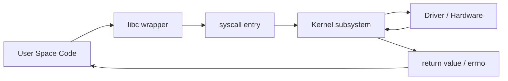

# System Call Path

## 一句話總結

System call 是 user space 合法進入 kernel 的入口，讓應用程式在不直接碰硬體與核心資源的前提下，安全地取得作業系統服務。

## 為什麼重要

對 Embedded Linux / OpenBMC 工程師來說，很多問題其實都卡在這條路徑上：

- `read()` 為什麼會卡住？
- `poll()` 為什麼等不到事件？
- `ioctl()` 為什麼會回 `-EINVAL` 或 `-EFAULT`？
- 一個 request 是卡在 user logic，還是已經進 kernel 但被 driver/blocking path 卡住？

如果不理解 system call path，很容易把所有 timeout 都誤判成 application bug。

## 從第一性原理解釋

Linux 要解決的問題是：

- user process 需要 I/O、network、memory mapping、device control
- 但不能讓它們直接用 privileged instruction 或直接控制 kernel state

所以 Linux 設計了一個受控入口：

`user code -> libc wrapper -> syscall entry -> kernel handler -> driver/subsystem -> return`

這讓 kernel 可以同時做到：

- 驗證參數
- 檢查權限
- 決定是否 block
- 保護核心資料結構

## 如果沒有這個機制

- 每個 user program 都得自己知道硬體控制細節
- 核心無法仲裁資源
- 錯誤隔離與安全模型會快速崩掉

## Embedded Linux Debug 角度

當你在 debug 時，如果看到：

- `strace` 卡在 `read()`
- `poll()` 長時間不返回
- `futex()` 一直等待

代表 user process 不是單純「沒有做事」，而是正停在某個 kernel interaction 上。

這時候要問的是：

1. 它正在等誰？
2. 它有沒有真的進到 driver path？
3. 是 event 沒來，還是 caller 沒被喚醒？

## OpenBMC 例子

以 `bmcweb` 或 sensor service 來看：

- user space service 透過 `read()`、socket、D-Bus 底層 IPC 與 kernel 互動
- kernel 再往下接到 VFS、socket layer、driver、bus transaction

如果 `busctl` request timeout，並不代表 D-Bus 一定壞掉。  
它可能只是某個更底層的 syscall path 沒返回。

## Mermaid 圖

## Interview Takeaway

如果面試官問 system call 在做什麼，我會回答：

System call 是 Linux 提供給 user space 的受控入口，讓 process 可以安全請求 kernel 服務。  
它不只是 mode switch，還包含參數驗證、權限檢查、資料複製與資源仲裁。
